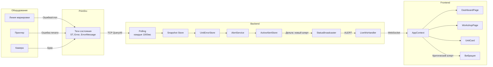
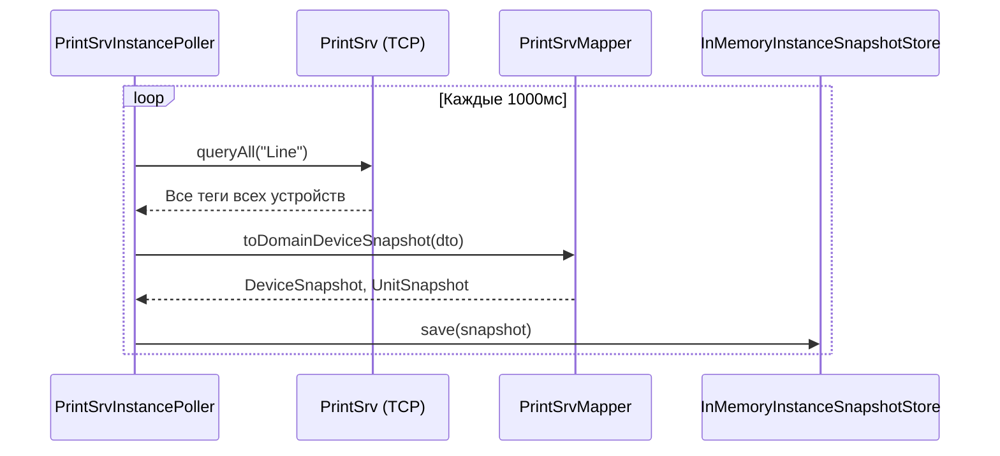
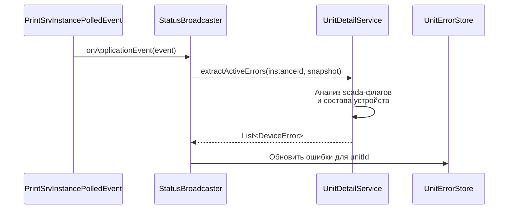
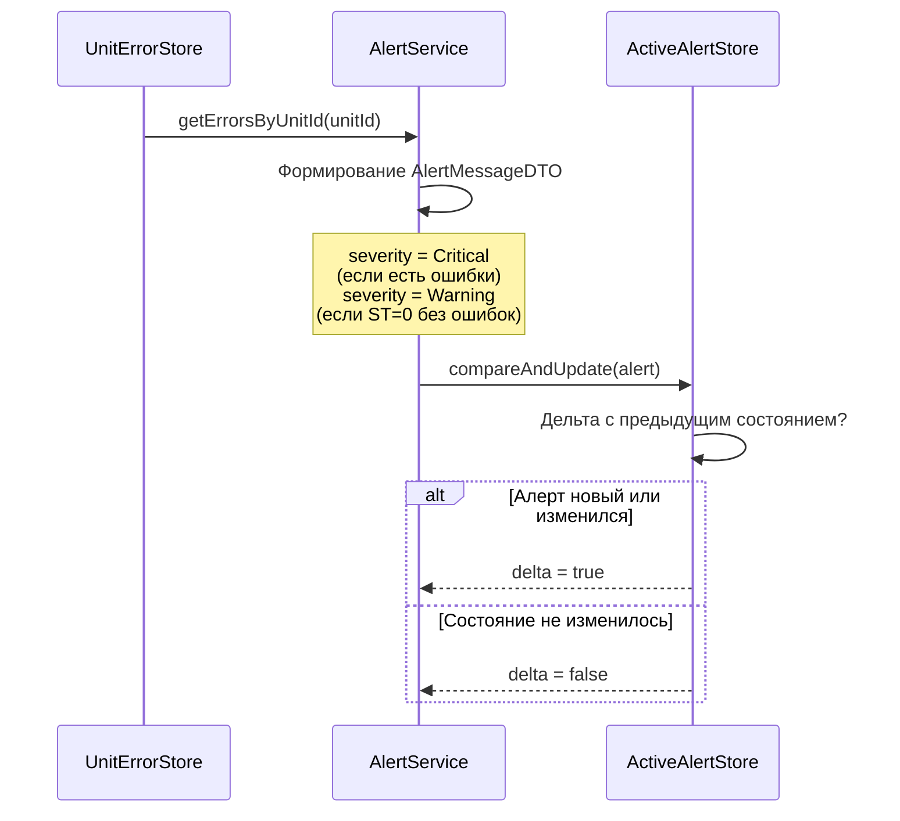
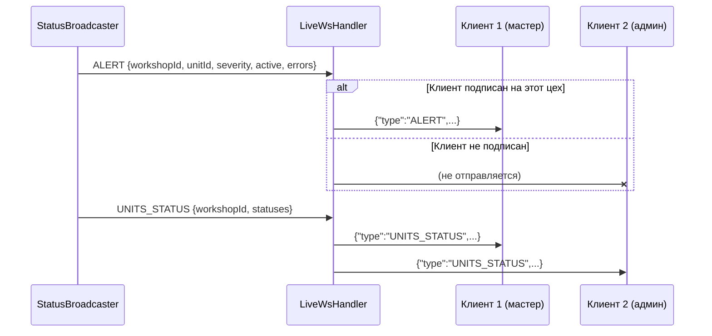
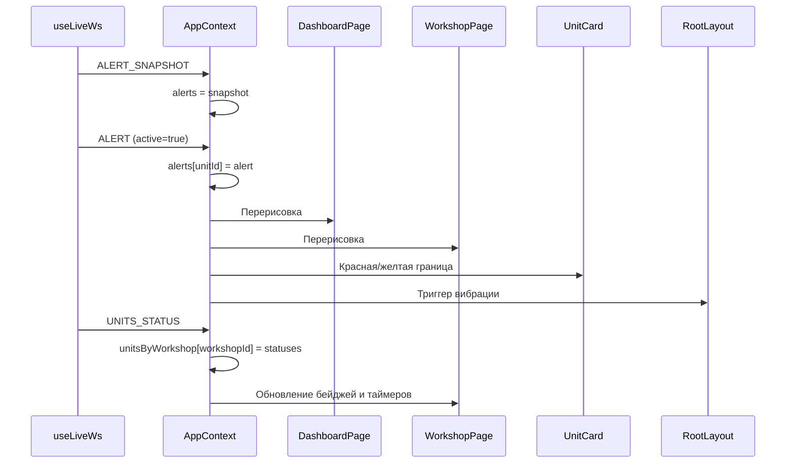
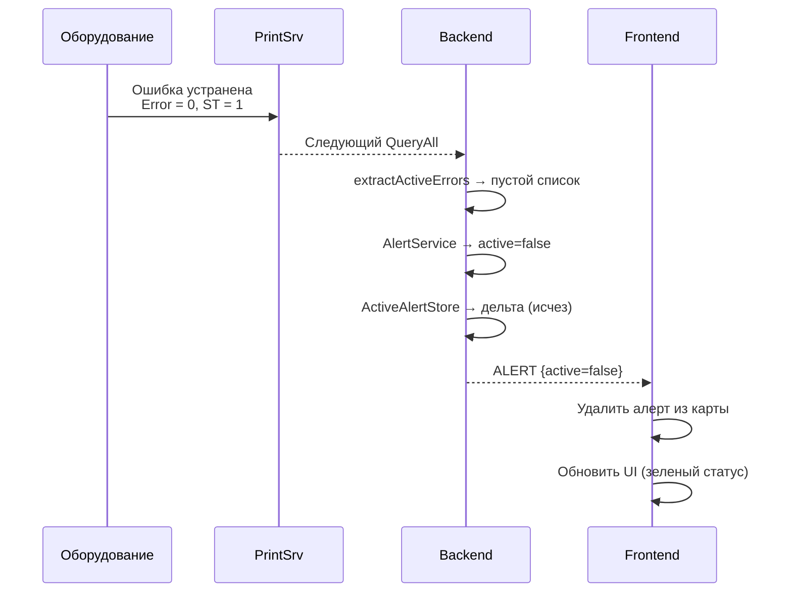

# Жизненный цикл алерта (SCADA Mobile)

## Purpose
Документ описывает полный жизненный цикл производственного алерта: от возникновения события на оборудовании до отображения пользователю и снятия.

## Table of contents
- [Purpose](#purpose)
- [Общая диаграмма](#общая-диаграмма)
- [Этап 1: Возникновение события на оборудовании](#этап-1-возникновение-события-на-оборудовании)
- [Этап 2: Опрос PrintSrv](#этап-2-опрос-printsrv)
- [Этап 3: Обнаружение ошибки](#этап-3-обнаружение-ошибки)
- [Этап 4: Вычисление алерта](#этап-4-вычисление-алерта)
- [Этап 5: Рассылка по WebSocket](#этап-5-рассылка-по-websocket)
- [Этап 6: Отображение на frontend](#этап-6-отображение-на-frontend)
- [Этап 7: Снятие алерта](#этап-7-снятие-алерта)
- [Временные характеристики](#временные-характеристики)

## Общая диаграмма

## Этап 1: Возникновение события на оборудовании

На производственной линии происходит одно из событий:

| Событие | Источник | Примеры |
|---------|----------|---------|
| Остановка линии | `Line.ST = 0` | Нет заготовок, оператор отвлекся |
| Ошибка линии | `Line.Error = 1` | Механическая неисправность |
| Ошибка принтера | `scada.LineDev011Error = 1` | Замятие ленты, нет чернил |
| Ошибка камеры | `scada.Dev041Error = 1` | Несчитанный код, брак |
| Ошибка checker-камеры | `CamChecker.BatchFailed > 0` | Дефект упаковки |

Эти события фиксируются в тегах PrintSrv в реальном времени.

## Этап 2: Опрос PrintSrv

- Backend опрашивает PrintSrv каждую секунду.
- Получает полный снапшот всех устройств (`Line`, `BatchQueue`, `PrinterXX`, `CamXX`, `scada`).
- Снапшот сохраняется в `InMemoryInstanceSnapshotStore`.

## Этап 3: Обнаружение ошибки

`UnitDetailService.extractActiveErrors` анализирует:
- `Line.Error`, `Line.ErrorMessage`, `Line.ST`
- `scada.lineerr`
- `scada.LineDev011Error`..`LineDev014Error` (принтеры)
- `scada.Dev041Error`..`Dev044Error` (камеры агрегации)
- `scada.Dev071Error`..`Dev074Error` (EAN-checker)
- Runtime-ошибки `CamChecker` (нет scada-обертки)

## Этап 4: Вычисление алерта

`AlertService` формирует:
- `workshopId`, `unitId`, `unitName` — из топологии
- `severity` — `Critical` (ошибки есть) или `Warning` (стоп без ошибок)
- `active` — `true` (появление) или `false` (снятие)
- `errors[]` — список `AlertErrorDTO` (device, code, message)
- `timestamp` — ISO-8601

`ActiveAlertStore` отслеживает дельту:
- Отправляет `ALERT` только при появлении или исчезновении алерта.
- Изменение состава ошибок при активном алерте **не** порождает новое сообщение.

## Этап 5: Рассылка по WebSocket

- `ALERT` отправляется только клиентам, подписанным на цех (`SUBSCRIBE_WORKSHOP`).
- `UNITS_STATUS` отправляется всем клиентам, подписанным на цех.
- При подключении нового клиента отправляется `ALERT_SNAPSHOT` — полный срез активных алертов.

## Этап 6: Отображение на frontend

### Визуальные индикаторы

| Элемент | Состояние | Индикация |
|---------|-----------|-----------|
| Карточка цеха | Норма | Зеленая статичная граница |
| Карточка цеха | Предупреждение | Желтая пульсирующая граница |
| Карточка цеха | Критично | Красная пульсирующая граница |
| Карточка автомата | Норма | Зеленый бейдж, нет таймера |
| Карточка автомата | Проблема | Красный/желтый бейдж, таймер простоя |
| Шапка деталей | Ошибка | Красная пульсирующая точка |
| Вибрация | Критический алерт | Паттерн вибрации (кулдаун 5 сек) |

### Вибрация

- Срабатывает при появлении активного критического алерта.
- Учитывает видимость страницы (`document.visibilityState`).
- Антиспам-кулдаун: 5 секунд между вибрациями.
- Не срабатывает при обновлении страницы или переподключении WebSocket.

## Этап 7: Снятие алерта

Алерт считается снятым, когда:
- `Line.Error = 0` и `Line.ST = 1`
- Все `scada.*Error = 0`
- Все runtime-ошибки устройств устранены

При снятии отправляется `ALERT` с `active=false`. Frontend удаляет алерт из карты и обновляет UI.

## Временные характеристики

| Этап | Время | Примечание |
|------|-------|------------|
| Возникновение → PrintSrv | < 1 сек | Зависит от оборудования |
| PrintSrv → Backend (опрос) | ≤ 1000 мс | Интервал polling |
| Backend → Frontend (WebSocket) | < 100 мс | Локальная сеть |
| **Общая задержка** | **≤ 2 сек** | От события до отображения |

В dev-профиле с mock-данными задержка может быть меньше из-за ускоренного polling.
