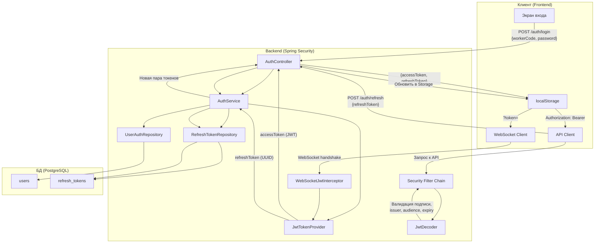
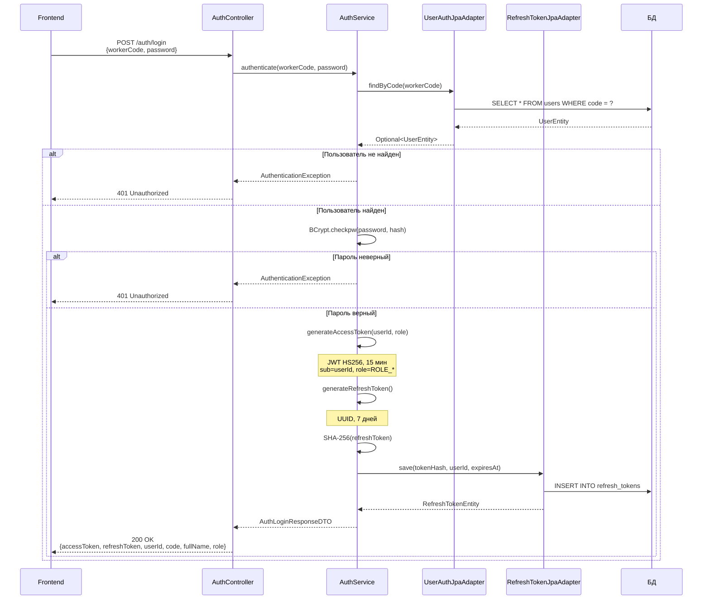
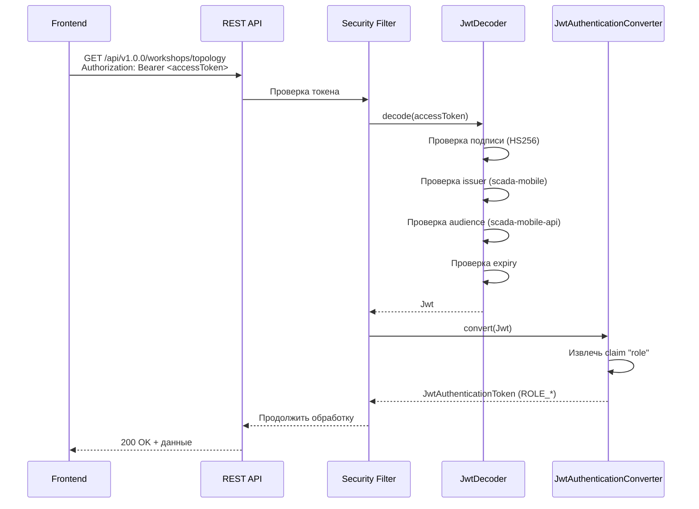
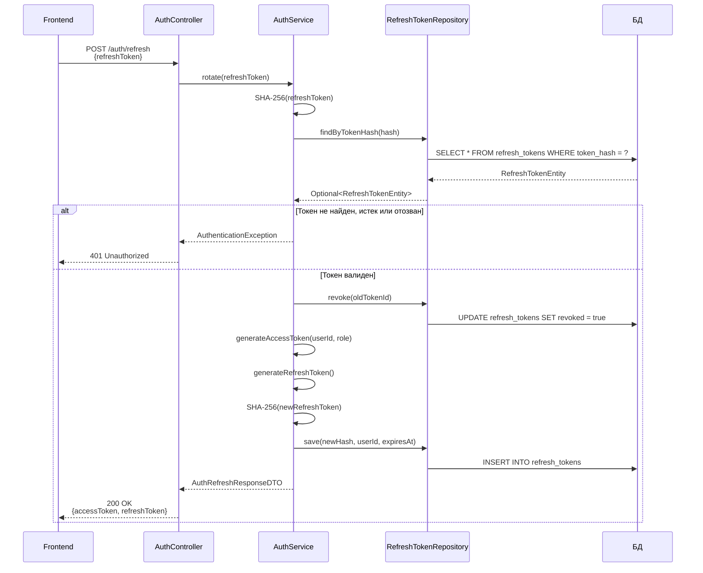
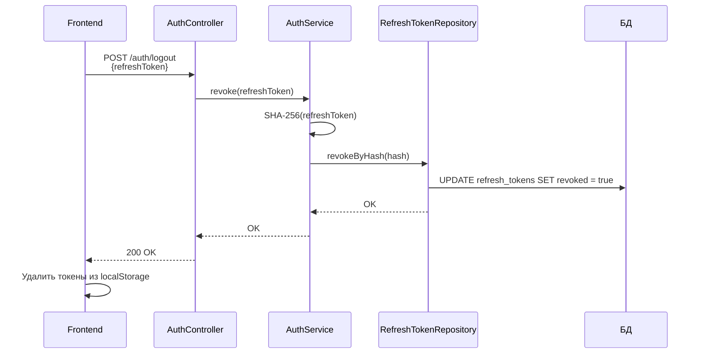
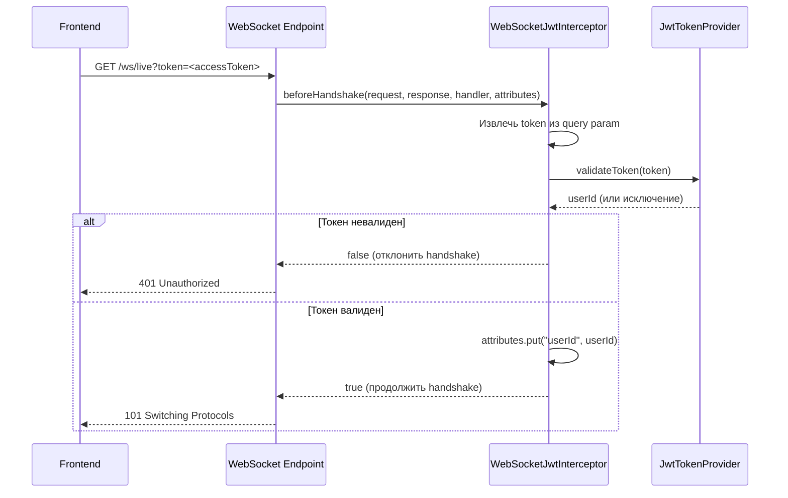
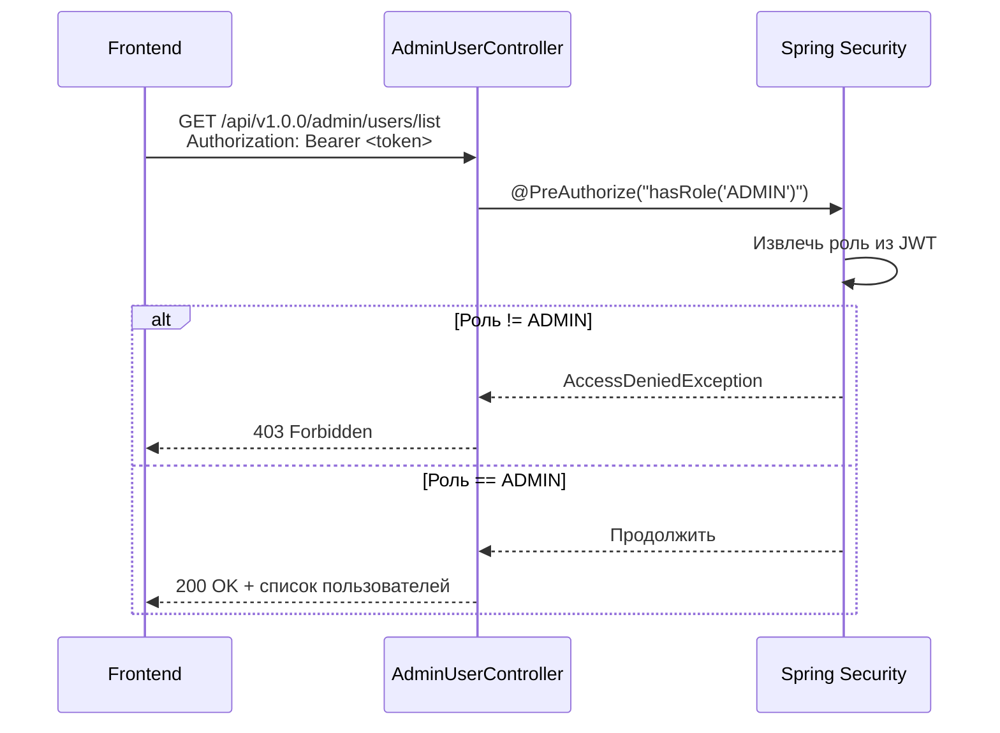

# Поток аутентификации (SCADA Mobile)

## Purpose
Документ описывает полный поток аутентификации и авторизации: от входа пользователя до WebSocket-соединения.

## Table of contents
- [Purpose](#purpose)
- [Общая диаграмма](#общая-диаграмма)
- [Этап 1: Вход (login)](#этап-1-вход-login)
- [Этап 2: Использование access token](#этап-2-использование-access-token)
- [Этап 3: Ротация токенов (refresh)](#этап-3-ротация-токенов-refresh)
- [Этап 4: Выход (logout)](#этап-4-выход-logout)
- [Этап 5: WebSocket аутентификация](#этап-5-websocket-аутентификация)
- [Этап 6: Доступ к админ-панели](#этап-6-доступ-к-админ-панели)
- [Сравнение токенов](#сравнение-токенов)

## Общая диаграмма

## Этап 1: Вход (login)

### Поля ответа login

| Поле | Описание |
|------|----------|
| `status` | `"success"` |
| `userId` | Числовой ID пользователя |
| `code` | Worker code (логин) |
| `fullName` | ФИО сотрудника |
| `role` | Роль (`ADMIN`, `USER`) |
| `accessToken` | JWT для доступа к API |
| `refreshToken` | UUID для обновления пары |

## Этап 2: Использование access token

## Этап 3: Ротация токенов (refresh)

### Почему ротация важна

- При компрометации access token злоумышленник имеет доступ максимум 15 минут.
- При компрометации refresh token он будет отозван при следующем легитимном использовании.
- Каждое обновление генерирует новую пару — старая пара становится недействительной.

## Этап 4: Выход (logout)

## Этап 5: WebSocket аутентификация

## Этап 6: Доступ к админ-панели

## Сравнение токенов

| Характеристика | Access Token | Refresh Token |
|----------------|--------------|---------------|
| Формат | JWT (HS256) | UUID (plain text) |
| Срок действия | 15 минут | 7 дней |
| Хранение на клиенте | localStorage | localStorage |
| Хранение на сервере | Не хранится | SHA-256 хеш в БД |
| Назначение | Доступ к API | Получение новой пары |
| Передача | Header `Authorization: Bearer` | Body JSON |
| Отзыв | Невозможен (stateless) | Возможен (флаг `revoked`) |
| Ротация | При каждом refresh | При каждом refresh |
