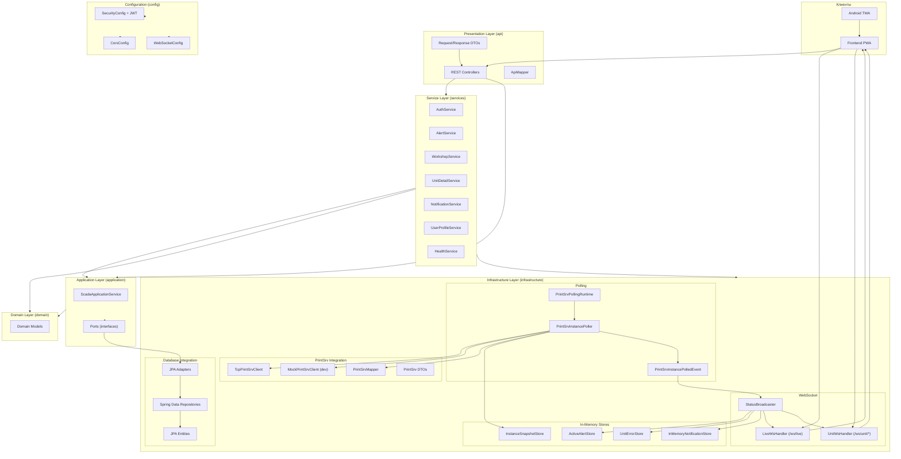

# Компонентная диаграмма backend (SCADA Mobile)

## Purpose
Визуальная карта слоев, пакетов и ключевых компонентов backend с указанием зависимостей между ними.

## Table of contents
- [Purpose](#purpose)
- [Диаграмма слоев](#диаграмма-слоев)
- [Описание слоев](#описание-слоев)
- [Поток данных между компонентами](#поток-данных-между-компонентами)

## Диаграмма слоев

## Описание слоев

### Presentation Layer (`api`)

| Компонент | Назначение |
|-----------|------------|
| `AuthController` | Аутентификация: login, logout, refresh |
| `Controller` | Топология (workshops, units, devices), health checks |
| `NotificationController` | Управление производственными уведомлениями |
| `NotificationSettingsController` | Настройки уведомлений пользователя |
| `UserProfileController` | Профиль текущего пользователя |
| `Admin*Controller` | CRUD операции для администратора |
| DTOs | Строго типизированные request/response объекты |
| `ApiMapper` | Маппинг между DTO и domain models |

### Service Layer (`services`)

| Компонент | Назначение |
|-----------|------------|
| `AuthService` | Аутентификация, валидация паролей, генерация JWT-пар |
| `AlertService` | Вычисление активных алертов из `UnitErrorStore` |
| `WorkshopService` | Топология, ETag, агрегация статусов цехов |
| `UnitDetailService` | Формирование детальных данных автомата |
| `NotificationService` | Жизненный цикл производственных уведомлений |
| `UserProfileService` | Профиль пользователя с назначенными автоматами |
| `HealthService` | Liveness/readiness пробы |
| `DeviceCompositionService` | Определение состава устройств автомата |
| `UnitMappingService` | Маппинг DB unitId ↔ PrintSrv instanceId |
| `ScadaKeyMapper` | Маппинг имен устройств PrintSrv → scada-ключи |

### Application Layer (`application`)

| Компонент | Назначение |
|-----------|------------|
| `ScadaApplicationService` | Координация use-cases |
| Ports (`*Repository`) | Интерфейсы для инфраструктурных адаптеров |

### Domain Layer (`domain`)

| Компонент | Назначение |
|-----------|------------|
| `AuthUser` | Идентификация пользователя |
| `UserProfile` | Профиль с назначенными автоматами |
| `DeviceSnapshot` | Снапшот состояния устройства |
| `UnitSnapshot` | Снапшот состояния автомата |
| `ProductionNotification` | Производственное уведомление |
| `UserNotificationSettings` | Настройки уведомлений |

### Infrastructure Layer (`infrastructure`)

| Компонент | Назначение |
|-----------|------------|
| JPA Entities | ORM-модели для PostgreSQL |
| JPA Repositories | Spring Data JPA интерфейсы |
| JPA Adapters | Реализация application ports |
| `TcpPrintSrvClient` | TCP-клиент для PrintSrv (prod) |
| `MockPrintSrvClient` | Mock-клиент с XML seed-файлами (dev) |
| `PrintSrvMapper` | ACL: PrintSrv DTO → domain models |
| `PrintSrvPollingRuntime` | Оркестрация polling-воркеров |
| `PrintSrvInstancePoller` | Опрос одного инстанса PrintSrv |
| `LiveWsHandler` | WebSocket `/ws/live` |
| `UnitWsHandler` | WebSocket `/ws/unit/{unitId}` |
| `StatusBroadcaster` | Рассылка событий подписчикам WebSocket |
| `InMemoryInstanceSnapshotStore` | Хранилище снапшотов |
| `UnitErrorStore` | Хранилище активных ошибок |
| `ActiveAlertStore` | Кеш вычисленных алертов |
| `InMemoryNotificationStore` | Хранилище производственных уведомлений |

## Поток данных между компонентами

1. **Polling**: `PrintSrvPollingRuntime` → `PrintSrvInstancePoller` → `PrintSrvClient.queryAll` → `PrintSrvMapper` → `InstanceSnapshotRepository.save`
2. **Alert computation**: `PrintSrvInstancePolledEvent` → `StatusBroadcaster` → `UnitErrorStore` → `AlertService` → `ActiveAlertStore`
3. **Broadcast**: `StatusBroadcaster` → `LiveWsHandler` → клиенты (`ALERT`, `UNITS_STATUS`)
4. **Unit details**: клиент → `UnitWsHandler` → `UnitDetailService` → `InstanceSnapshotRepository` → `LINE_STATUS`, `DEVICES_STATUS`, `QUEUE`, `ERRORS`
5. **REST API**: клиент → `Controller` → `WorkshopService` / `UserProfileService` → JPA Adapters → БД
