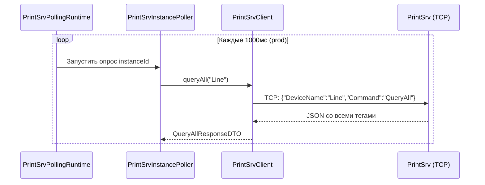
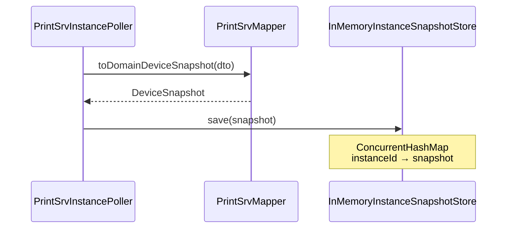
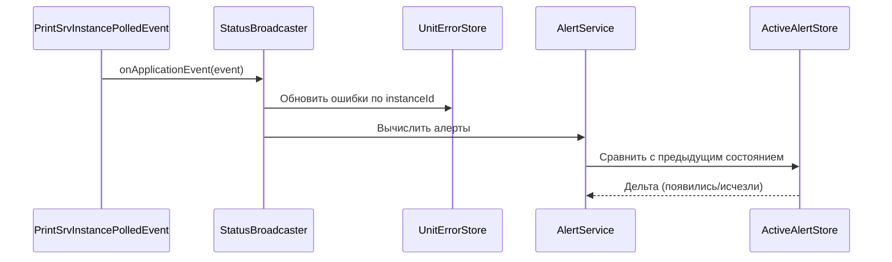
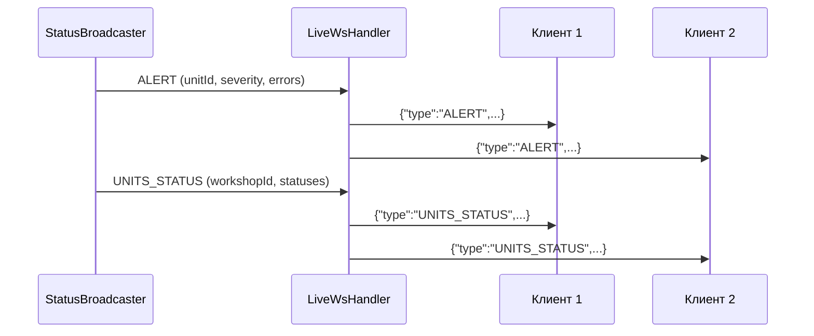
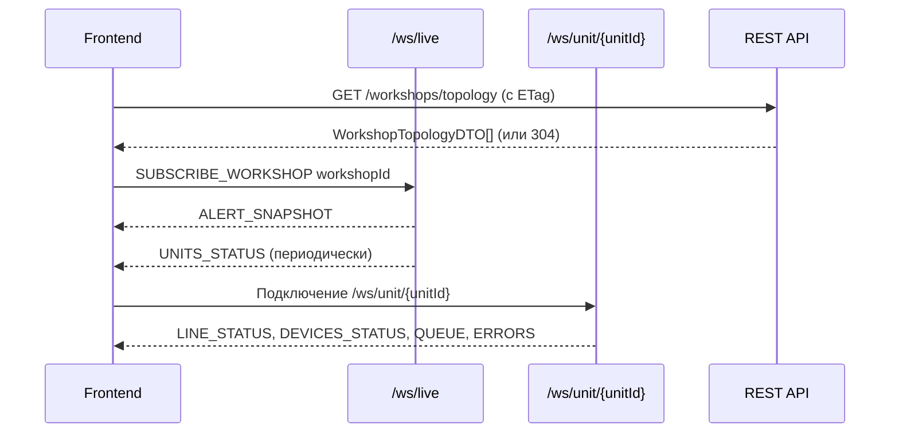
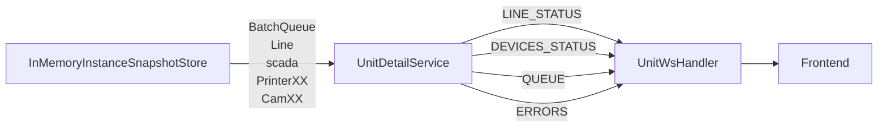
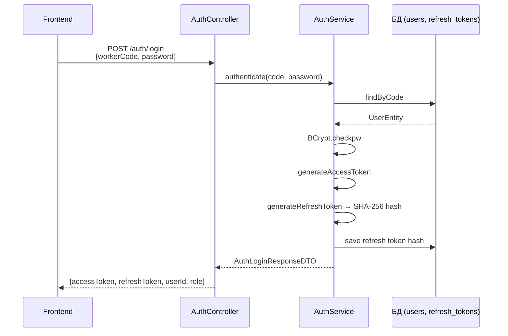

# Поток данных в backend (SCADA Mobile)

## Purpose
Детальная диаграмма потока данных от источника (PrintSrv) до потребителя (frontend), с указанием всех промежуточных этапов преобразования.

## Table of contents
- [Purpose](#purpose)
- [Общая диаграмма потока](#общая-диаграмма-потока)
- [Этап 1: Опрос PrintSrv](#этап-1-опрос-printsrv)
- [Этап 2: Сохранение снапшота](#этап-2-сохранение-снапшота)
- [Этап 3: Вычисление алертов](#этап-3-вычисление-алертов)
- [Этап 4: WebSocket-рассылка](#этап-4-websocket-рассылка)
- [Этап 5: Получение frontend](#этап-5-получение-frontend)
- [Поток данных деталей автомата](#поток-данных-деталей-автомата)
- [Поток аутентификации](#поток-аутентификации)

## Общая диаграмма потока

```mermaid
flowchart LR
    subgraph External["Внешняя система"]
        PrintSrv["PrintSrv<br/>(TCP сервер маркировки)"]
    end

    subgraph Backend["Backend: Spring Boot"]
        direction TB
        Polling["Polling Layer<br/>PrintSrvPollingRuntime"]
        Mapper["Anti-Corruption Layer<br/>PrintSrvMapper"]
        Snapshot["Snapshot Store<br/>InMemoryInstanceSnapshotStore"]
        ErrorStore["UnitErrorStore"]
        AlertService["AlertService"]
        AlertStore["ActiveAlertStore"]
        Broadcaster["StatusBroadcaster"]
        LiveWs["LiveWsHandler<br/>/ws/live"]
        UnitWs["UnitWsHandler<br/>/ws/unit/{unitId}"]
        UnitDetail["UnitDetailService"]
        Workshop["WorkshopService"]
        Controller["REST Controller"]
    end

    subgraph Client["Клиент"]
        Frontend["Frontend PWA"]
    end

    PrintSrv -->|"TCP QueryAll<br/>каждые 1000мс"| Polling
    Polling -->|"QueryAllResponseDTO"| Mapper
    Mapper -->|"DeviceSnapshot<br/>UnitSnapshot"| Snapshot
    Snapshot --> ErrorStore
    ErrorStore --> AlertService
    AlertService --> AlertStore
    AlertStore --> Broadcaster
    Broadcaster -->|"ALERT<br/>ALERT_SNAPSHOT<br/>UNITS_STATUS"| LiveWs
    Snapshot --> UnitDetail
    UnitDetail -->|"LINE_STATUS<br/>DEVICES_STATUS<br/>QUEUE<br/>ERRORS"| UnitWs
    Snapshot --> Workshop
    Workshop -->|"ETag-cached topology"| Controller
    Controller -->|"REST /api/v1.0.0/*"| Frontend
    LiveWs -->|"WebSocket"| Frontend
    UnitWs -->|"WebSocket"| Frontend
```

## Этап 1: Опрос PrintSrv

- `PrintSrvPollingRuntime` управляет жизненным циклом polling-воркеров (SmartLifecycle).
- Каждый инстанс PrintSrv опрашивается в отдельном виртуальном потоке.
- Интервал опроса: 1000мс в prod, настраивается через `printsrv.polling.fixed-delay-ms`.

## Этап 2: Сохранение снапшота

- `PrintSrvMapper` изолирует домен от протокола PrintSrv (Anti-Corruption Layer).
- `InMemoryInstanceSnapshotStore` — thread-safe хранилище на `ConcurrentHashMap`.
- При недоступности PrintSrv snapshot очищается (graceful degradation).

## Этап 3: Вычисление алертов

- `UnitErrorStore` — единый источник правды об активных ошибках.
- `AlertService` вычисляет `AlertMessageDTO` с severity (текущая реализация: только `Critical`).
- `ActiveAlertStore` отслеживает дельту: отправляет `ALERT` только при появлении или исчезновении.

## Этап 4: WebSocket-рассылка

- `LiveWsHandler` мультиплексирует сообщения для всех подключенных клиентов.
- Клиенты подписываются на конкретный цех через `SUBSCRIBE_WORKSHOP`.
- `UnitWsHandler` обслуживает per-unit канал для детальных данных.

## Этап 5: Получение frontend

## Поток данных деталей автомата

- `UnitDetailService` извлекает данные из снапшота и формирует 4 типа сообщений.
- При подключении отправляется начальный пакет из 4 сообщений (`sendInitialSnapshot`).
- Канал push-only: клиент только получает данные.

## Поток аутентификации

Подробнее: [AUTH_FLOW.md](AUTH_FLOW.md).
