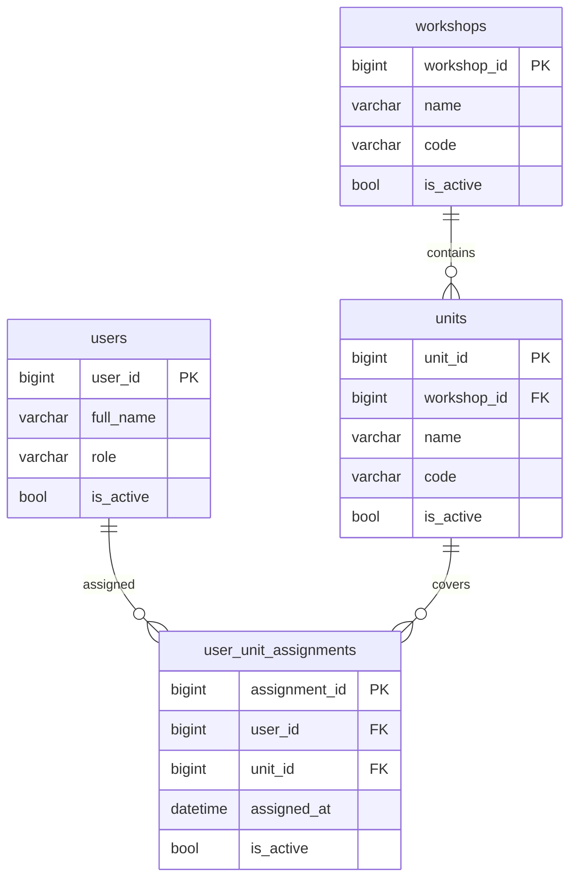

# Концепция базы данных уведомлений

## Purpose

Коротко и понятно объяснить, какие таблицы нужны для системы производственных уведомлений и как они связаны между собой.

## Table of contents

- [Контекст системы](#контекст-системы)
- [Диаграмма сущностей](#диаграмма-сущностей)
- [Назначение таблиц](#назначение-таблиц)
- [Атрибуты таблиц](#атрибуты-таблиц)

## Контекст системы

Производственная линия состоит из цехов и аппаратов. Аппараты генерируют сигналы (стоп, ошибка, ожидание материала), которые считываются PrintSrv и превращаются backend в понятные инциденты. Эти инциденты показываются в интерфейсе и распространяются как уведомления.

Чтобы уведомления были адресными и корректными, системе нужно знать, какие сотрудники закреплены за какими аппаратами. Это влияет сразу на два сценария: на отображение интерфейса и на проверку, имеет ли пользователь право отправить уведомление от конкретного аппарата.

## Диаграмма сущностей

## Назначение таблиц

### Справочные таблицы

#### Пользователи (users)

Таблица Пользователи (users) нужна, чтобы система знала всех сотрудников, которые могут получать уведомления и работать с интерфейсом. Она задает базовую личность пользователя и его роль на производстве. Без нее невозможно определить, кто получает уведомления и кому доступен интерфейс.

#### Цеха (workshops)

Таблица Цеха (workshops) фиксирует производственные зоны предприятия. Она формирует верхний уровень структуры, к которому привязаны аппараты и события. Без цехов система теряет контекст места и не может объяснить, где именно произошел инцидент.

#### Аппараты (units)

Таблица Аппараты (units) описывает конкретные участки или машины, от которых приходят сигналы. Аппараты являются источниками инцидентов и привязкой для уведомлений. Без этой таблицы невозможно связать событие с реальным оборудованием.

### Оперативные таблицы

#### Связь пользователей с аппаратами (user_unit_assignments)

Таблица Связь пользователей с аппаратами (user_unit_assignments) хранит текущие назначения сотрудников на аппараты. Она определяет, за что отвечает конкретный работник, и используется для контроля прав: можно ли отправлять уведомление от имени выбранного аппарата. Без нее невозможно адресно показывать информацию и проверять доступ.

## Атрибуты таблиц

### Пользователи (users, атрибуты)

- ID пользователя (`user_id`) — уникальный идентификатор; используется как ключ связи и для авторизации действий.
- ФИО (`full_name`) — имя сотрудника, отображаемое в интерфейсе и журнале действий; бизнес-данные.
- Роль (`role`) — роль или должность (например, оператор, мастер); определяет контекст участия в процессах; бизнес-данные.
- Активен (`is_active`) — признак, что сотрудник участвует в текущих сменах; нужен для фильтрации и выключения доступа; бизнес-данные.

### Цеха (workshops, атрибуты)

- ID цеха (`workshop_id`) — уникальный идентификатор; используется в связях и навигации по структуре.
- Название (`name`) — название цеха, отображается в интерфейсе и уведомлениях; бизнес-данные.
- Код (`code`) — короткий внутренний код для стабильной идентификации в интеграциях; бизнес-данные.
- Активен (`is_active`) — признак актуальности цеха в структуре предприятия; бизнес-данные.

### Аппараты (units, атрибуты)

- ID аппарата (`unit_id`) — уникальный идентификатор; используется для связи с событиями и назначениями.
- ID цеха (`workshop_id`) — ссылка на цех, где находится аппарат; связь.
- Название (`name`) — понятное название аппарата, отображается в уведомлениях; бизнес-данные.
- Код (`code`) — короткий код аппарата для быстрой идентификации и интеграций; бизнес-данные.
- Активен (`is_active`) — признак, что аппарат участвует в текущем мониторинге; бизнес-данные.

### Связь пользователей с аппаратами (user_unit_assignments, атрибуты)

- ID назначения (`assignment_id`) — уникальный идентификатор; нужен для управления и аудита.
- ID пользователя (`user_id`) — ссылка на пользователя; связь, определяет адресата и право отправки уведомлений.
- ID аппарата (`unit_id`) — ссылка на аппарат; связь, определяет область ответственности.
- Назначен с (`assigned_at`) — момент назначения; используется для истории и анализа изменений.
- Активно (`is_active`) — актуальность назначения; позволяет быстро отключать старые связи без потери истории.
