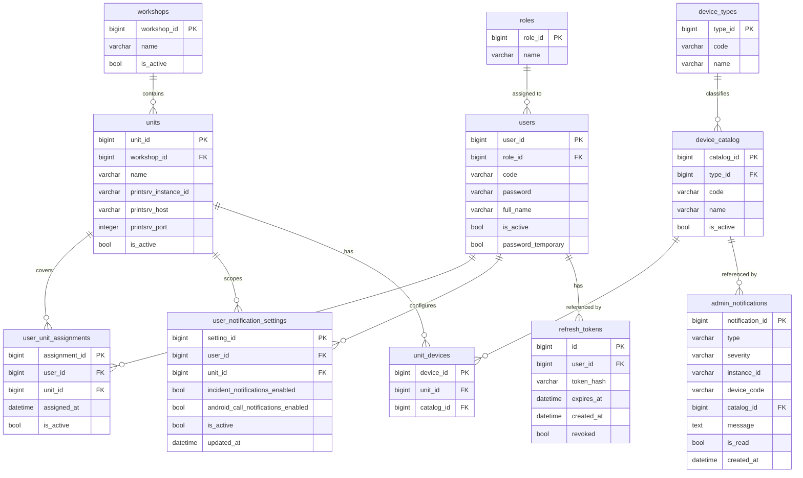

# Концепция базы данных

## Purpose

Коротко и понятно объяснить, какие таблицы нужны для системы и как они связаны между собой.

Актуальность: 16.07.2026.

## Table of contents

- [Контекст системы](#контекст-системы)
- [Диаграмма сущностей](#диаграмма-сущностей)
- [Матрица прав](#матрица-прав)
- [Назначение таблиц](#назначение-таблиц)
- [Атрибуты таблиц](#атрибуты-таблиц)
- [Места хранения данных](#места-хранения-данных)

## Контекст системы

Производственная линия состоит из цехов и автоматов. Автоматы генерируют сигналы (стоп, ошибка, ожидание материала), которые считываются PrintSrv и превращаются backend в понятные инциденты. Эти инциденты показываются в интерфейсе и распространяются как уведомления.

Чтобы уведомления были адресными и корректными, системе нужно знать, какие сотрудники закреплены за какими автоматами. Это влияет сразу на два сценария: на отображение интерфейса и на проверку, имеет ли пользователь право отправить уведомление от конкретного автомата.

Единый источник правды по пользователям, автоматам, назначениям и настройкам уведомлений хранится в БД. Внешние идентификаторы в API совпадают с числовыми первичными ключами таблиц.

## Диаграмма сущностей

> **Примечание:** если диаграмма выше не отображается в вашем просмотрщике, используйте PNG-версию: [DB_NOTIFICATIONS_CONCEPT.png](DB_NOTIFICATIONS_CONCEPT.png).

## Матрица прав

| Действие | Администратор | Мастер (фасовка) | Мастер (палетайзер) |
| :--- | :---: | :---: | :---: |
| Добавление и редактирование данных в БД (ролей, юзеров, цехов, аппаратов и т.д.) | + | - | - |
| Назначение мастера на автомат | + | - | - |
| Настройка получения уведомлений о происшествиях (= уведомления на карточках) | - | + | + |
| Настройка получения уведомлений от других работников, вызванных намерено (= уведомления Android) | - | + | + |

## Назначение таблиц

### Справочные таблицы

#### Роли (roles)

Таблица Роли (`roles`) определяет уровни доступа и должностные обязанности сотрудников (например, мастер, администратор). Она позволяет централизованно управлять правами и группировать пользователей по их функциям. Без нее невозможно гибко настраивать доступ к функциям системы.

#### Пользователи (users)

Таблица Пользователи (`users`) нужна, чтобы система знала всех сотрудников, которые могут получать уведомления и работать с интерфейсом. Она задает базовую личность пользователя и связывает его с конкретной ролью. Дополнительно хранит уникальный код входа и пароль (bcrypt), под которыми пользователь авторизуется в системе. Поле `password_temporary` помечает учётные записи, созданные администратором, — при первом входе такой пользователь обязан сменить пароль.

#### Цеха (workshops)

Таблица Цеха (`workshops`) фиксирует производственные зоны предприятия. Она формирует верхний уровень структуры, к которому привязаны автоматы и события. Без цехов система теряет контекст места и не может объяснить, где именно произошел инцидент.

#### Автоматы (units)

Таблица Автоматы (`units`) описывает конкретные участки или машины, от которых приходят сигналы. Автоматы являются источниками инцидентов и привязкой для уведомлений. Без этой таблицы невозможно связать событие с реальным оборудованием. Поля `printsrv_instance_id`, `printsrv_host` и `printsrv_port` связывают автомат с конкретным инстансом PrintSrv и задают адрес для опроса.

#### Типы устройств (device_types)

Таблица Типы устройств (`device_types`) содержит справочник категорий оборудования, подключенного к автоматам (например: принтеры, камеры агрегации, камеры-чекеры). Она позволяет классифицировать устройства для корректной обработки данных бэкендом и отображения в UI.

#### Каталог устройств (device_catalog)

Таблица Каталог устройств (`device_catalog`) — единый справочник всех устройств, которые могут встречаться на автоматах. Каждая запись описывает runtime-код устройства (`code`), понятное имя (`name`), тип (`type_id`) и признак активности (`is_active`). Тип может быть не задан (`type_id` nullable) при авто-обнаружении устройства, пока администратор не настроит его вручную. Уникальность обеспечивается по полям `code` и `name`.

#### Устройства автоматов (unit_devices)

Таблица Устройства автоматов (`unit_devices`) фиксирует привязку конкретных записей из каталога (`device_catalog`) к автоматам (`units`). Она связывает физические объекты из PrintSrv с доменной моделью системы. Без нее невозможно определить, из каких именно камер или принтеров строятся данные мониторинга для конкретной линии.

### Оперативные таблицы

#### Связь пользователей с автоматами (user_unit_assignments)

Таблица Связь пользователей с автоматами (`user_unit_assignments`) хранит текущие назначения сотрудников на автоматы. Она определяет, за что отвечает конкретный работник, и используется для контроля прав: можно ли отправлять уведомление от имени выбранного автомата. Без нее невозможно адресно показывать информацию и проверять доступ.

#### Настройки уведомлений пользователя (user_notification_settings)

Таблица Настройки уведомлений пользователя (`user_notification_settings`) хранит параметры получения уведомлений для конкретного пользователя и автомата. Она определяет, включены ли уведомления о происшествиях (карточки) и разрешены ли Android push-уведомления при намеренном вызове персонала. Без нее невозможно централизованно управлять каналами доставки и пользовательскими предпочтениями.

#### Refresh-токены (refresh_tokens)

Таблица Refresh-токены (`refresh_tokens`) хранит refresh-токены для stateless-аутентификации. Каждый токен связан с пользователем, хранится в виде SHA-256 хеша, имеет срок действия и флаг отзыва. Это позволяет реализовать безопасную ротацию токенов и принудительный выход из системы.

#### Системные уведомления администратора (admin_notifications)

Таблица Системные уведомления администратора (`admin_notifications`) хранит события, требующие внимания администратора: авто-обнаружение неизвестных устройств, расхождения каталога, проблемы с инстансами PrintSrv и т.п. Уведомление может ссылаться на запись каталога (`catalog_id`), чтобы администратор мог быстро перейти к редактированию устройства. Поля `is_read` и `created_at` управляют жизненным циклом и сортировкой.

## Атрибуты таблиц

### Роли (roles, атрибуты)

- ID роли (`role_id`) — уникальный идентификатор; используется для связей.
- Название (`name`) — понятное имя роли (например, "Оператор линии"); бизнес-данные; уникально.

### Пользователи (users, атрибуты)

- ID пользователя (`user_id`) — уникальный идентификатор; используется как ключ связи и для авторизации действий.
- ID роли (`role_id`) — ссылка на роль пользователя; определяет набор прав и контекст действий; связь.
- Код входа (`code`) — уникальный человекочитаемый код для логина, генерируется системой в фиксированном формате (например, `USR-000001`); используется вместо email/логина.
- Пароль (`password`) — хеш пароля (bcrypt); используется вместе с `code`.
- ФИО (`full_name`) — имя сотрудника, отображаемое в интерфейсе и журнале действий; бизнес-данные.
- Активен (`is_active`) — признак, что сотрудник участвует в текущих сменах; нужен для фильтрации и выключения доступа; бизнес-данные.
- Временный пароль (`password_temporary`) — признак, что пароль сгенерирован администратором и требует обязательной смены при первом входе.

### Цеха (workshops, атрибуты)

- ID цеха (`workshop_id`) — уникальный идентификатор; используется в связях и навигации по структуре.
- Название (`name`) — название цеха, отображается в интерфейсе и уведомлениях; бизнес-данные; уникально.
- Активен (`is_active`) — признак актуальности цеха в структуре предприятия; бизнес-данные.

### Автоматы (units, атрибуты)

- ID автомата (`unit_id`) — уникальный идентификатор; используется для связи с событиями и назначениями.
- ID цеха (`workshop_id`) — ссылка на цех, где находится автомат; связь.
- Название (`name`) — понятное название автомата, отображается в уведомлениях; бизнес-данные.
- PrintSrv instance ID (`printsrv_instance_id`) — строковый идентификатор инстанса PrintSrv (например, `trepko1`, `hassia4`); используется для опроса данных.
- PrintSrv хост (`printsrv_host`) — IP-адрес или имя хоста инстанса PrintSrv; используется для TCP-соединения.
- PrintSrv порт (`printsrv_port`) — порт инстанса PrintSrv; используется для TCP-соединения.
- Активен (`is_active`) — признак, что автомат участвует в текущем мониторинге; бизнес-данные.
- Уникальность обеспечивается по паре (`name`, `printsrv_instance_id`).

### Типы устройств (device_types, атрибуты)

- ID типа (`type_id`) — уникальный идентификатор.
- Код (`code`) — строковый идентификатор категории (например, `printer`, `checker_cam`); используется в логике бэкенда для группировки; уникален.
- Название (`name`) — понятное имя типа для отображения в интерфейсе настройки; уникально.

### Каталог устройств (device_catalog, атрибуты)

- ID записи (`catalog_id`) — уникальный идентификатор.
- ID типа (`type_id`) — ссылка на тип устройства; может быть `NULL` до ручной настройки авто-обнаруженного устройства.
- Код (`code`) — runtime-имя объекта из PrintSrv (например, `CamBatch`, `Printer11`); уникален.
- Название (`name`) — понятное имя устройства для отображения в интерфейсе; уникально.
- Активен (`is_active`) — признак, что запись каталога используется; позволяет скрывать устаревшие устройства без удаления.

### Устройства автоматов (unit_devices, атрибуты)

- ID устройства автомата (`device_id`) — уникальный идентификатор связи.
- ID автомата (`unit_id`) — ссылка на автомат, к которому подключено устройство; связь.
- ID каталога (`catalog_id`) — ссылка на запись в `device_catalog`; связь.

### Связь пользователей с автоматами (user_unit_assignments, атрибуты)

- ID назначения (`assignment_id`) — уникальный идентификатор; нужен для управления и аудита.
- ID пользователя (`user_id`) — ссылка на пользователя; связь, определяет адресата и право отправки уведомлений.
- ID автомата (`unit_id`) — ссылка на автомат; связь, определяет область ответственности.
- Назначен с (`assigned_at`) — момент назначения; используется для истории и анализа изменений.
- Активно (`is_active`) — актуальность назначения; позволяет быстро отключать старые связи без потери истории.

### Настройки уведомлений пользователя (user_notification_settings, атрибуты)

- ID настройки (`setting_id`) — уникальный идентификатор.
- ID пользователя (`user_id`) — ссылка на пользователя; связь.
- ID автомата (`unit_id`) — ссылка на автомат; связь, определяет область действия настройки.
- Уведомления о происшествиях (`incident_notifications_enabled`) — включает/выключает получение уведомлений на карточках.
- Уведомления от других работников (`android_call_notifications_enabled`) — разрешает/запрещает Android push-уведомления при намеренном вызове персонала.
- Активно (`is_active`) — актуальность настройки; позволяет отключать записи без удаления.
- Обновлено (`updated_at`) — время последнего изменения настроек.
- Уникальность обеспечивается по паре (`user_id`, `unit_id`).

### Refresh-токены (refresh_tokens, атрибуты)

- ID токена (`id`) — уникальный идентификатор.
- ID пользователя (`user_id`) — ссылка на пользователя; связь.
- Хеш токена (`token_hash`) — SHA-256 хеш refresh-токена; уникальный.
- Срок действия (`expires_at`) — дата и время истечения токена.
- Создан (`created_at`) — дата и время создания токена.
- Отозван (`revoked`) — флаг принудительного отзыва токена.

### Системные уведомления администратора (admin_notifications, атрибуты)

- ID уведомления (`notification_id`) — уникальный идентификатор.
- Тип (`type`) — строковый тип события (например, `DEVICE_AUTO_DISCOVERED`, `CATALOG_MISMATCH`); определяет источник и логику обработки.
- Важность (`severity`) — уровень критичности (`INFO`, `WARNING`, `ERROR`).
- ID инстанса (`instance_id`) — идентификатор PrintSrv-инстанса, к которому относится событие.
- Код устройства (`device_code`) — runtime-код устройства, если событие связано с конкретным устройством.
- ID каталога (`catalog_id`) — ссылка на `device_catalog`, если уведомление связано с записью каталога; может быть `NULL`.
- Сообщение (`message`) — текст уведомления для администратора.
- Прочитано (`is_read`) — флаг прочтения уведомления.
- Создано (`created_at`) — дата и время создания уведомления.

## Места хранения данных

| Данные | Место хранения | Примечание |
| :--- | :--- | :--- |
| Роли, пользователи, цеха, автоматы | БД | таблицы `roles`, `users`, `workshops`, `units` |
| Типы и каталог устройств, устройства автоматов | БД | таблицы `device_types`, `device_catalog`, `unit_devices` |
| Назначение мастера на автомат | БД | таблица `user_unit_assignments` |
| Настройки уведомлений пользователя | БД | таблица `user_notification_settings` |
| Refresh-токены | БД | таблица `refresh_tokens` |
| Системные уведомления администратора | БД | таблица `admin_notifications` |
| Снапшоты состояния устройств | In-memory | `InMemoryInstanceSnapshotStore` |
| Активные алерты | In-memory | `ActiveAlertStore`, `UnitErrorStore` |
| Производственные уведомления | In-memory | `InMemoryNotificationStore` |

**Примечание:** Настройки уведомлений пользователя хранятся в БД как единый источник правды. В профиле на фронтенде предусмотрено разграничение: уведомления о происшествиях (карточки) и вызовы персонала (Android push).
