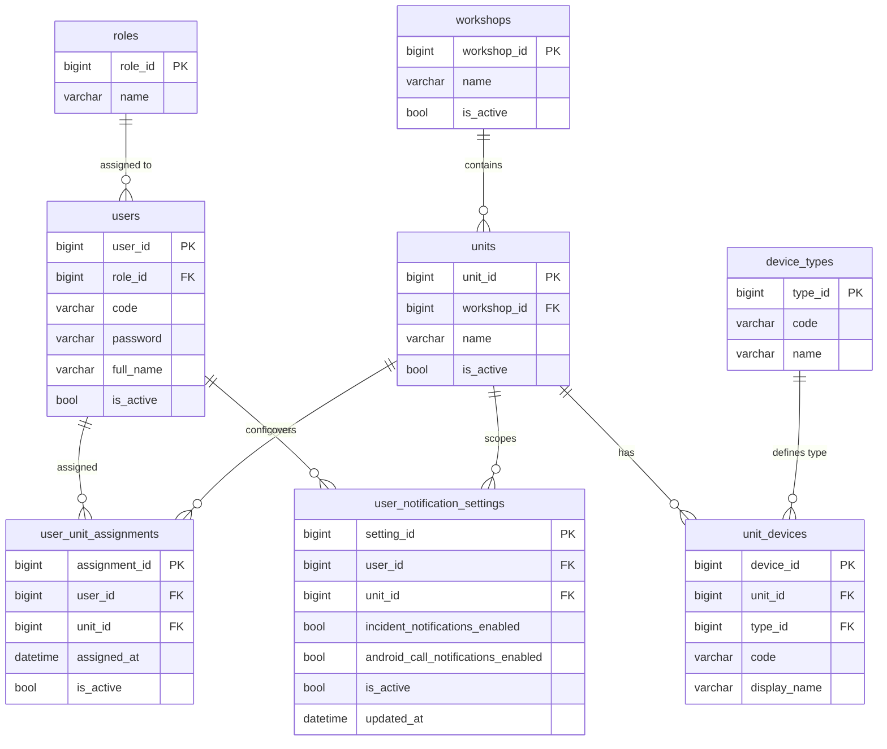

# Концепция базы данных уведомлений

## Purpose

Коротко и понятно объяснить, какие таблицы нужны для системы производственных уведомлений и как они связаны между собой.

## Table of contents

- [Контекст системы](#контекст-системы)
- [Диаграмма сущностей](#диаграмма-сущностей)
- [Матрица прав](#матрица-прав)
- [Назначение таблиц](#назначение-таблиц)
- [Атрибуты таблиц](#атрибуты-таблиц)
- [Места хранения данных](#места-хранения-данных)

## Контекст системы

Производственная линия состоит из цехов и автоматов. Автоматы генерируют сигналы (стоп, ошибка, ожидание материала), которые считываются PrintSrv и превращаются backend в понятные инциденты. Эти инциденты показываются в интерфейсе и распространяются как уведомления.

Чтобы уведомления были адресными и корректными, системе нужно знать, какие сотрудники закреплены за какими автоматами. Это влияет сразу на два сценария: на отображение интерфейса и на проверку, имеет ли пользователь право отправить уведомление от конкретного автомата.

Единый источник правды по пользователям, автоматам, назначениям и настройкам уведомлений хранится в БД. Внешние идентификаторы в API совпадают с числовыми первичными ключами таблиц.

## Диаграмма сущностей

## Матрица прав

| Действие | Администратор | Мастер (фасовка) | Мастер (палетайзер) |
| :--- | :---: | :---: | :---: |
| Добавление и редактирование данных в БД (ролей, юзеров, цехов, аппаратов и т.д.) | + | - | - |
| Назначение мастера на автомат | + | - | - |
| Настройка получения уведомлений о происшествиях (= уведомления на карточках) | - | + | + |
| Настройка получения уведомлений от других работников, вызванных намерено (= уведомления Android) | - | + | + |

## Назначение таблиц

### Справочные таблицы

#### Роли (roles)

Таблица Роли (roles) определяет уровни доступа и должностные обязанности сотрудников (например, мастер, администратор). Она позволяет централизованно управлять правами и группировать пользователей по их функциям. Без нее невозможно гибко настраивать доступ к функциям системы.

#### Пользователи (users)

Таблица Пользователи (users) нужна, чтобы система знала всех сотрудников, которые могут получать уведомления и работать с интерфейсом. Она задает базовую личность пользователя и связывает его с конкретной ролью. Дополнительно хранит уникальный код входа и пароль, под которыми пользователь авторизуется в системе. Без нее невозможно определить, кто получает уведомления и кому доступен интерфейс.

#### Цеха (workshops)

Таблица Цеха (workshops) фиксирует производственные зоны предприятия. Она формирует верхний уровень структуры, к которому привязаны автоматы и события. Без цехов система теряет контекст места и не может объяснить, где именно произошел инцидент.

#### Автоматы (units)

Таблица Автоматы (units) описывает конкретные участки или машины, от которых приходят сигналы. Автоматы являются источниками инцидентов и привязкой для уведомлений. Без этой таблицы невозможно связать событие с реальным оборудованием.

#### Типы устройств (device_types)

Таблица Типы устройств (device_types) содержит справочник категорий оборудования, подключенного к автоматам (например: принтеры, камеры агрегации, камеры-чекеры). Она позволяет классифицировать устройства для корректной обработки данных бэкендом и отображения в UI.

#### Устройства автоматов (unit_devices)

Таблица Устройства автоматов (unit_devices) фиксирует конкретный состав оборудования для каждого автомата. Она связывает физические объекты из PrintSrv с доменной моделью системы. Без нее невозможно определить, из каких именно камер или принтеров строятся данные мониторинга для конкретной линии.

### Оперативные таблицы

#### Связь пользователей с автоматами (user_unit_assignments)

Таблица Связь пользователей с автоматами (user_unit_assignments) хранит текущие назначения сотрудников на автоматы. Она определяет, за что отвечает конкретный работник, и используется для контроля прав: можно ли отправлять уведомление от имени выбранного автомата. Без нее невозможно адресно показывать информацию и проверять доступ.

#### Настройки уведомлений пользователя (user_notification_settings)

Таблица Настройки уведомлений пользователя (user_notification_settings) хранит параметры получения уведомлений для конкретного пользователя и автомата. Она определяет, включены ли уведомления о происшествиях (карточки) и разрешены ли Android push-уведомления при намеренном вызове персонала. Без нее невозможно централизованно управлять каналами доставки и пользовательскими предпочтениями.

## Атрибуты таблиц

### Роли (roles, атрибуты)

- ID роли (`role_id`) — уникальный идентификатор; используется для связей.
- Название (`name`) — понятное имя роли (например, "Оператор линии"); бизнес-данные.

### Пользователи (users, атрибуты)

- ID пользователя (`user_id`) — уникальный идентификатор; используется как ключ связи и для авторизации действий.
- ID роли (`role_id`) — ссылка на роль пользователя; определяет набор прав и контекст действий; связь.
- Код входа (`code`) — уникальный человекочитаемый код для логина, генерируется системой в фиксированном формате (например, `USR-000001`); используется вместо email/логина.
- Пароль (`password`) — уникальный человекочитаемый код для входа, генерируется системой в фиксированном формате (например, `PWD-000001`); используется вместе с `code`.
- ФИО (`full_name`) — имя сотрудника, отображаемое в интерфейсе и журнале действий; бизнес-данные.
- Активен (`is_active`) — признак, что сотрудник участвует в текущих сменах; нужен для фильтрации и выключения доступа; бизнес-данные.

### Цеха (workshops, атрибуты)

- ID цеха (`workshop_id`) — уникальный идентификатор; используется в связях и навигации по структуре.
- Название (`name`) — название цеха, отображается в интерфейсе и уведомлениях; бизнес-данные.
- Активен (`is_active`) — признак актуальности цеха в структуре предприятия; бизнес-данные.

### Автоматы (units, атрибуты)

- ID автомата (`unit_id`) — уникальный идентификатор; используется для связи с событиями и назначениями.
- ID цеха (`workshop_id`) — ссылка на цех, где находится автомат; связь.
- Название (`name`) — понятное название автомата, отображается в уведомлениях; бизнес-данные.
- Активен (`is_active`) — признак, что автомат участвует в текущем мониторинге; бизнес-данные.

### Типы устройств (device_types, атрибуты)

- ID типа (`type_id`) — уникальный идентификатор.
- Код (`code`) — строковый идентификатор категории (например, `printer`, `checker_cam`); используется в логике бэкенда для группировки.
- Название (`name`) — понятное имя типа для отображения в интерфейсе настройки.

### Устройства автоматов (unit_devices, атрибуты)

- ID устройства (`device_id`) — уникальный идентификатор.
- ID автомата (`unit_id`) — ссылка на автомат, к которому подключено устройство; связь.
- ID типа (`type_id`) — ссылка на категорию устройства; связь.
- Код (`code`) — имя объекта, как оно задано в PrintSrv (например, `CamBatch`); используется для маппинга входящих сигналов.
- Отображаемое имя (`display_name`) — понятное название конкретного устройства (например, "Камера партии"); бизнес-данные.

### Связь пользователей с автоматами (user_unit_assignments, атрибуты)

- ID назначения (`assignment_id`) — уникальный идентификатор; нужен для управления и аудита.
- ID пользователя (`user_id`) — ссылка на пользователя; связь, определяет адресата и право отправки уведомлений.
- ID автомата (`unit_id`) — ссылка на автомат; связь, определяет область ответственности.
- Назначен с (`assigned_at`) — момент назначения; используется для истории и анализа изменений.
- Активно (`is_active`) — актуальность назначения; позволяет быстро отключать старые связи без потери истории.

### Настройки уведомлений пользователя (user_notification_settings, атрибуты)

- ID настройки (`setting_id`) — уникальный идентификатор.
- ID пользователя (`user_id`) — ссылка на пользователя; связь.
- ID автомата (`unit_id`) — ссылка на автомат; связь, определяет область действия настройки.
- Уведомления о происшествиях (`incident_notifications_enabled`) — включает/выключает получение уведомлений на карточках.
- Уведомления от других работников (`android_call_notifications_enabled`) — разрешает/запрещает Android push-уведомления при намеренном вызове персонала.
- Активно (`is_active`) — актуальность настройки; позволяет отключать записи без удаления.
- Обновлено (`updated_at`) — время последнего изменения настроек.

## Места хранения данных

| Данные | Место хранения | Примечание |
| :--- | :--- | :--- |
| Настройки уведомлений пользователя | БД | таблица `user_notification_settings` |
| Назначение мастера на автомат | БД | таблица `user_unit_assignments` |

**Примечание 1:** Настройки уведомлений пользователя теперь хранятся в БД как единый источник правды. В профиле на фронтенде предусмотрено разграничение: уведомления о происшествиях (карточки) и вызовы персонала (Android push).
**P.s.** Галочка в настройках управляет получением уведомлений: для карточек инцидентов и для Android push при намеренном вызове персонала.
