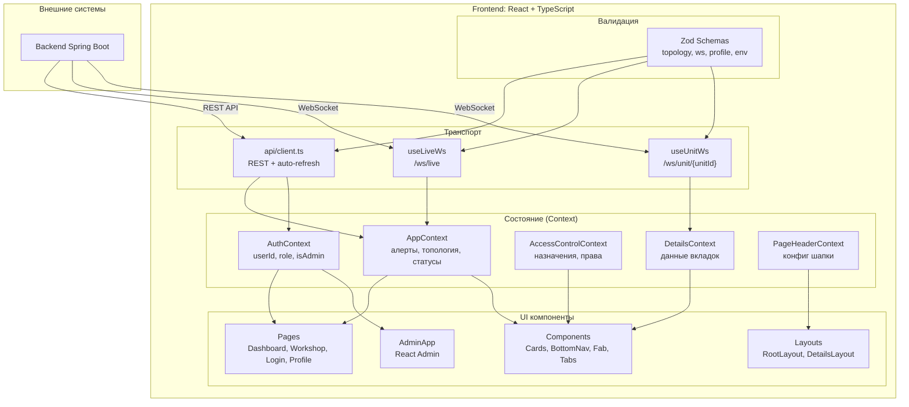
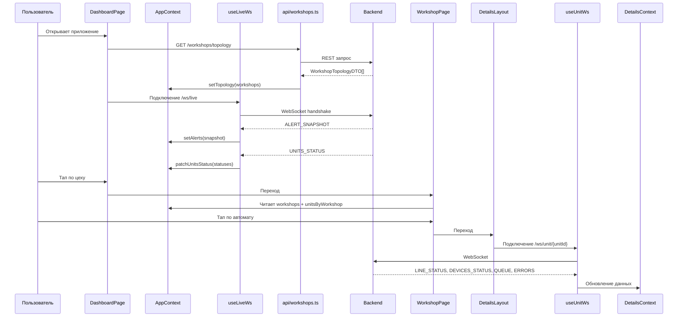

# Архитектура frontend (SCADA Mobile)

## Purpose
Документ описывает архитектуру веб-клиента: компоненты, управление состоянием, валидацию данных, транспортные каналы и поток данных.

## Table of contents
- [Purpose](#purpose)
- [Общая диаграмма](#общая-диаграмма)
- [Технологический стек](#технологический-стек)
- [Управление состоянием](#управление-состоянием)
- [Транспортные каналы](#транспортные-каналы)
- [Валидация данных](#валидация-данных)
- [Маршрутизация](#маршрутизация)
- [Компонентная архитектура](#компонентная-архитектура)
- [Поток данных](#поток-данных)
- [Обработка ошибок](#обработка-ошибок)

## Общая диаграмма



## Технологический стек

| Технология | Версия | Назначение |
|------------|--------|------------|
| React | 18 | UI-фреймворк |
| TypeScript | 5 (strict) | Типизация |
| Vite | 6 | Сборка, dev-сервер |
| Tailwind CSS | 3 | Утилитарные стили |
| Zod | 3 | Runtime-валидация, источник типов |
| React Router | 7 | Маршрутизация |
| React Admin | 4 | Админ-панель |

## Управление состоянием

Без внешних state-библиотек (Redux, Zustand). Используются React Context + useReducer.

### AuthContext

```
Состояние: { userId, role, isAdmin, isAuthenticated }
Действия: login(response), logout(), refresh()
Хранение: localStorage (tokens, userId, role, assignedUnits)
```

- Провайдер на уровне `App.tsx` (глобальный).
- `RequireAuth` — guard для защищенных маршрутов.
- `RequireAdmin` — guard для админ-панели.

### AppContext

```
Состояние:
  - topology: { workshops, unitsByWorkshop, devicesTopology, eTags }
  - live: { alerts, notifications, unitsStatus, workshopsStatus }
  - headerErrors: Map<slot, error>
  - signalStates: { live: 'connected' | 'reconnecting' | 'error' }

Действия:
  - setTopology, patchUnitsStatus, setAlert, removeAlert
  - setNotification, setHeaderError, clearHeaderError
```

- Центральное состояние приложения.
- Провайдер внутри `RootLayout`.
- `workshops` и `unitsByWorkshop` — computed values (memo), объединяют топологию + live-статусы.

### AccessControlContext

```
Состояние: { assignedUnitIds, isAssignedUnit(unitId), canUseUnitAction(unitId) }
Хранение: localStorage (assignedUnits из профиля)
```

- Определяет, может ли пользователь отправлять уведомления от имени автомата.
- FAB-кнопка "Последняя партия" видна только при `canUseUnitAction(currentUnitId)`.

### DetailsContext

```
Состояние:
  - lineData: LineStatus | null
  - devicesData: Record<deviceName, DeviceInfo>
  - queueData: QueueItem[]
  - errorsData: { deviceErrors, logs }
  - devicesTopology: DevicesTopology | null
  - unitSignal: 'connected' | 'reconnecting' | 'error'
  - pageError: AppError | null
```

- Локальное состояние для экрана деталей автомата.
- Провайдер внутри `DetailsLayout`.
- Данные приходят из `useUnitWs` + REST (devices topology).

### PageHeaderContext

```
Состояние: { title, subtitle, showBack, onBack, rightActions }
Действия: setConfig(config), resetConfig()
```

- Декларативная конфигурация шапки страницы.
- Каждая страница через `usePageHeader()` устанавливает свой заголовок.

## Транспортные каналы

### REST API (`api/client.ts`)

```typescript
apiFetch(endpoint, options)
  → Автоматически добавляет Authorization: Bearer <accessToken>
  → При 401: refresh token → retry запроса
  → При неудаче refresh: logout + redirect /login
```

- Централизованный клиент с очередью запросов (предотвращает дублирование refresh).
- `apiFetchJson` — обертка с автоматическим JSON-парсингом.

### WebSocket `/ws/live` (`useLiveWs`)

- Единое соединение на всю сессию приложения.
- Сообщения: `ALERT_SNAPSHOT`, `ALERT`, `NOTIFICATION_SNAPSHOT`, `NOTIFICATION`, `UNITS_STATUS`.
- Подписка на цех: `SUBSCRIBE_WORKSHOP` / `UNSUBSCRIBE_WORKSHOP`.
- Reconnect: экспоненциальный backoff + jitter через `createManagedWs`.

### WebSocket `/ws/unit/{unitId}` (`useUnitWs`)

- Отдельное соединение для экрана деталей автомата.
- Сообщения: `LINE_STATUS`, `DEVICES_STATUS`, `QUEUE`, `ERRORS`.
- Автоматическое подключение при входе на экран, cleanup при выходе.

## Валидация данных

Zod-схемы — единый источник правды для типов:

| Схема | Файл | Что валидирует |
|-------|------|----------------|
| `WorkshopTopologySchema` | `schemas/topology.ts` | REST: список цехов |
| `UnitTopologySchema` | `schemas/topology.ts` | REST: список автоматов |
| `DevicesTopologySchema` | `schemas/topology.ts` | REST: устройства автомата |
| `LiveMessageSchema` | `schemas/ws.ts` | WebSocket `/ws/live` |
| `UnitMessageSchema` | `schemas/ws.ts` | WebSocket `/ws/unit/{unitId}` |
| `UserProfileSchema` | `schemas/profile.ts` | Профиль пользователя |
| `EnvSchema` | `schemas/env.ts` | Переменные окружения |

TypeScript-типы выводятся автоматически:
```typescript
type WorkshopTopology = z.infer<typeof WorkshopTopologySchema>;
```

## Маршрутизация

React Router v7 с `createBrowserRouter`:

```
/                              → RootLayout
  /login                       → LoginPage
  / (index)                    → DashboardPage        [RequireAuth]
  /workshops/:workshopId       → WorkshopPage         [RequireAuth]
  /profile                     → ProfilePage          [RequireAuth]
  /notifications               → NotificationsPage    [RequireAuth]
  /admin/*                     → AdminApp             [RequireAuth → RequireAdmin]
  /workshops/:workshopId/units/:unitId
    → redirect to /batch
    /batch                     → BatchTab             [RequireAuth]
    /devices                   → DevicesTab           [RequireAuth]
    /queue                     → QueueTab             [RequireAuth]
    /logs                      → LogsTab              [RequireAuth]
  *                            → redirect to /
```

Все страницы и вкладки — lazy-loaded (`React.lazy` + `Suspense`).

## Компонентная архитектура

### Layout-компоненты

| Компонент | Назначение |
|-----------|------------|
| `RootLayout` | Провайдеры App + PageHeader, глобальный WS, шапка |
| `DetailsLayout` | BottomNav, FAB, DetailsProvider, unit WS, табы через `<Outlet />` |

### Страницы

| Страница | Назначение |
|----------|------------|
| `DashboardPage` | Список цехов с live-статусами |
| `WorkshopPage` | Список автоматов цеха |
| `LoginPage` | Форма входа (workerCode + password) |
| `ProfilePage` | Профиль, настройки уведомлений, выход |
| `NotificationsPage` | История производственных уведомлений |

### Переиспользуемые компоненты

| Компонент | Назначение |
|-----------|------------|
| `WorkshopCard` | Карточка цеха с статусом |
| `UnitCard` | Карточка автомата с бейджем и таймером |
| `NotificationCard` | Карточка уведомления |
| `BottomNav` | Нижний таббар (4 таба) |
| `Fab` | FAB-кнопка "Последняя партия" |
| `PageHeader` | Единая шапка (back, title, error indicator, actions) |
| `TabContentState` | Обёртка: loading → skeleton → error → content |
| `UnitErrorBoard` | Отображение активных ошибок |

### Вкладки деталей

| Вкладка | Данные | Источник |
|---------|--------|----------|
| `BatchTab` | Информация о партии | `LINE_STATUS` (WS) |
| `DevicesTab` | Статусы устройств | `DEVICES_STATUS` (WS) |
| `QueueTab` | Очередь партий | `QUEUE` (WS) |
| `LogsTab` | Активные ошибки + журнал | `ERRORS` (WS) |

## Поток данных



## Обработка ошибок

### Классификация ошибок (`errors/classifyError.ts`)

Все ошибки (fetch, WebSocket, parse) нормализуются в `AppError`:
- `source`: `'fetch' | 'ws' | 'parse'`
- `status`: HTTP-статус или код WS
- `message`: человекочитаемое описание

### ErrorBoundary (`errors/ErrorBoundary.tsx`)

- Глобальный React Error Boundary.
- Отлавливает ошибки рендера.
- Показывает fallback UI с кнопкой перезагрузки.

### Header errors (`useHeaderErrorSlot`)

- Любой fetch/WS error публикуется в `AppContext.headerErrors`.
- `PageHeader` показывает баннер ошибки.
- `usePageError` агрегирует ошибки из нескольких источников.

### Состояния загрузки

- **Первичная загрузка**: skeleton-заглушки (никаких спиннеров).
- **Пустой список**: информационный текст.
- **Ошибка сервера**: fallback на последние успешные данные + индикатор устаревания.
- **Отсутствие значения**: прочерк "-".
