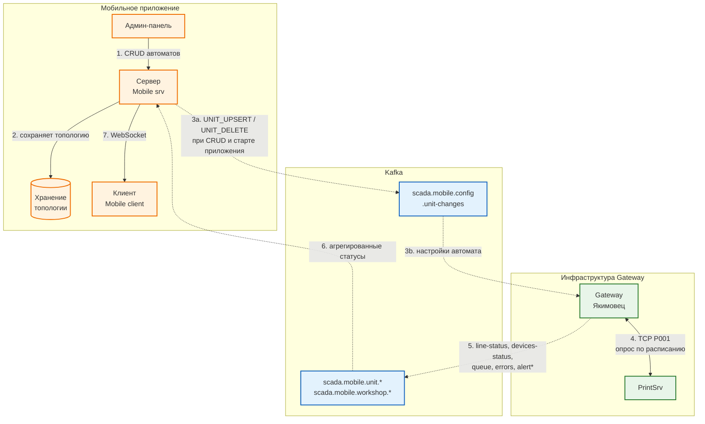

# Поток данных: Mobile Svr → Kafka → Gateway → PrintSrv

## Purpose

Наглядная схема взаимодействия модуля Mobile Svr с PrintSrv через Kafka и Gateway (Якимовец). Показывает, какие данные, в каком направлении и при каких условиях перетекают между компонентами.

Актуальность: 16.07.2026.

## Диаграмма

> **Примечание:** Kafka на схеме условно разделена на два логических блока — конфигурационный топик (сверху) и data-топики (снизу) — чтобы не перегружать схему пересекающимися стрелками. Физически это один Kafka-кластер.

## Пояснение к потокам

| # | Направление | Что передаётся | Условие / триггер |
|:-:|:---|:---|:---|
| 1 | Админ-панель → Mobile Svr | Создание / изменение / удаление автомата | Пользователь сохраняет изменения в админ-панели |
| 2 | Mobile Svr → БД | Топология: цеха, автоматы, устройства, настройки | Всегда при CRUD-операциях |
| 3 | Mobile Svr → Kafka → Gateway | `UNIT_UPSERT` / `UNIT_DELETE` | При любом изменении автомата и при старте приложения для всех активных автоматов |
| 4 | Gateway ↔ PrintSrv | P001 TCP-фреймы с JSON внутри | Gateway опрашивает PrintSrv по расписанию; адрес берётся из конфигурации Kafka |
| 5 | Gateway → Kafka | `line-status`, `devices-status`, `queue`, `errors`, `alert` | Регулярно; `alert` публикуется **только при изменении** списка ошибок |
| 6 | Kafka → Mobile Svr | Топики `scada.mobile.unit.{instanceId}.*` и `scada.mobile.workshop.{workshopId}.units-status` | Kafka Consumer группы `scada-mobile-backend` читает постоянно |
| 7 | Mobile Svr → Mobile client | WebSocket-сообщения с live-статусами | Когда данные из Kafka обработаны и готовы к показу |

## Ключевые принципы

- **Никакой прямой связи** между Mobile Svr и Gateway — только Kafka.
- **Gateway единолично общается с PrintSrv** по TCP (P001-фрейм, windows-1251).
- **Mobile Svr публикует конфигурацию** автоматов в Kafka, а Gateway подписывается и управляет опросом.
- **WebSocket-формат на фронтенд не меняется** — меняется только источник данных внутри Mobile Svr.
- **Алерты публикуются по дельте**, а не каждый цикл, чтобы не перегружать Kafka.
