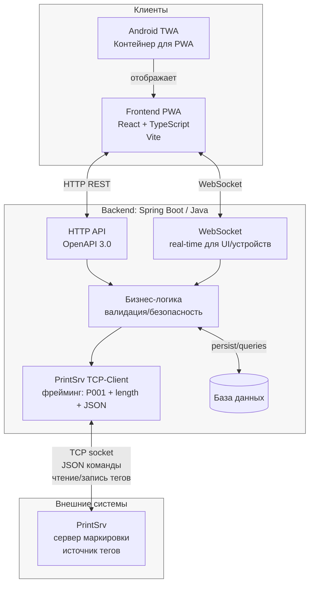
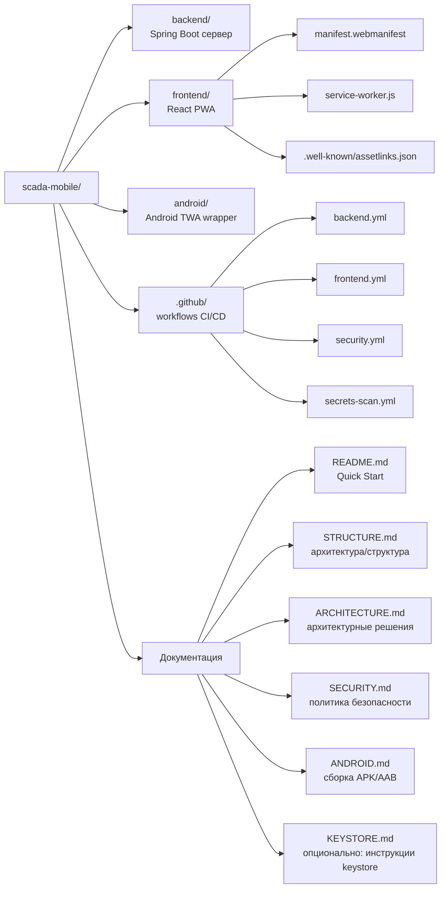

# Диаграмма структуры проекта (Mermaid)

Ниже две диаграммы:

1) **Архитектура и потоки данных** — как связаны PWA/Android, Backend и PrintSrv.
2) **Структура репозитория** — укрупнённая карта папок/документов.

> Источник правды для этой диаграммы: `STRUCTURE.md`.

## 1) Архитектура и потоки данных

## 2) Укрупнённая структура репозитория

