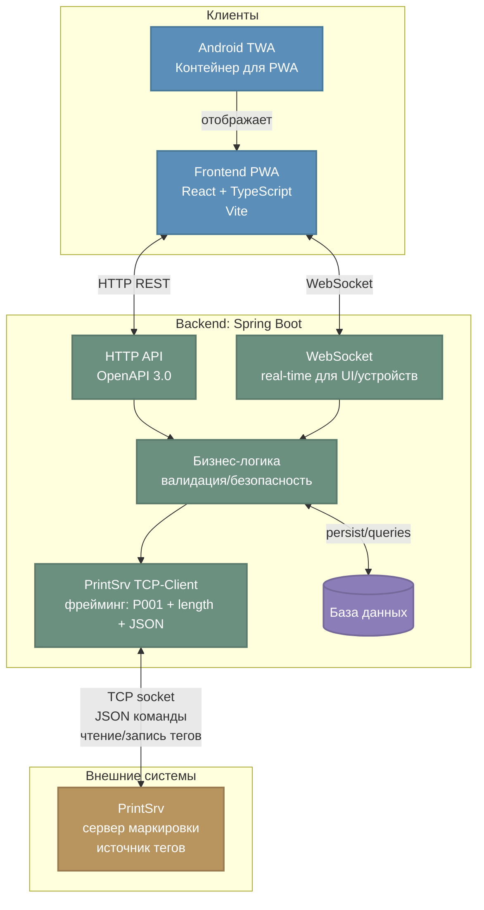
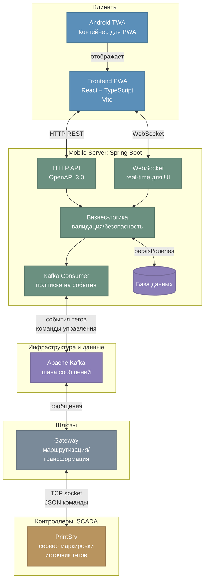

# Диаграмма архитектуры проекта (Mermaid)

Ниже представлены две архитектурные схемы:

1) **Упрощенная архитектура (для разработки)** — прямое подключение Backend к PrintSrv через TCP, используется на этапе локальной разработки и тестирования.
2) **Production архитектура** — полная схема с инфраструктурными компонентами (Kafka, Gateway), как интегрируется в общую систему.

> Источник правды для технических деталей: `STRUCTURE.md`.

## 1) Упрощенная архитектура (для разработки)

## 2) Production архитектура (полная схема)

---

**Пояснения:**

- **Упрощенная схема** используется для локальной разработки: Mobile Server напрямую подключается к PrintSrv по TCP (как описано в `STRUCTURE.md`).
- **Production схема** отражает реальную интеграцию: Mobile Server → Kafka → Gateway → PrintSrv. Kafka обеспечивает асинхронную доставку событий, Gateway выполняет маршрутизацию и протокольную трансформацию.
