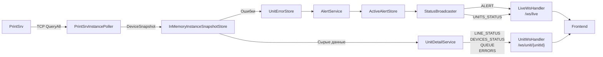
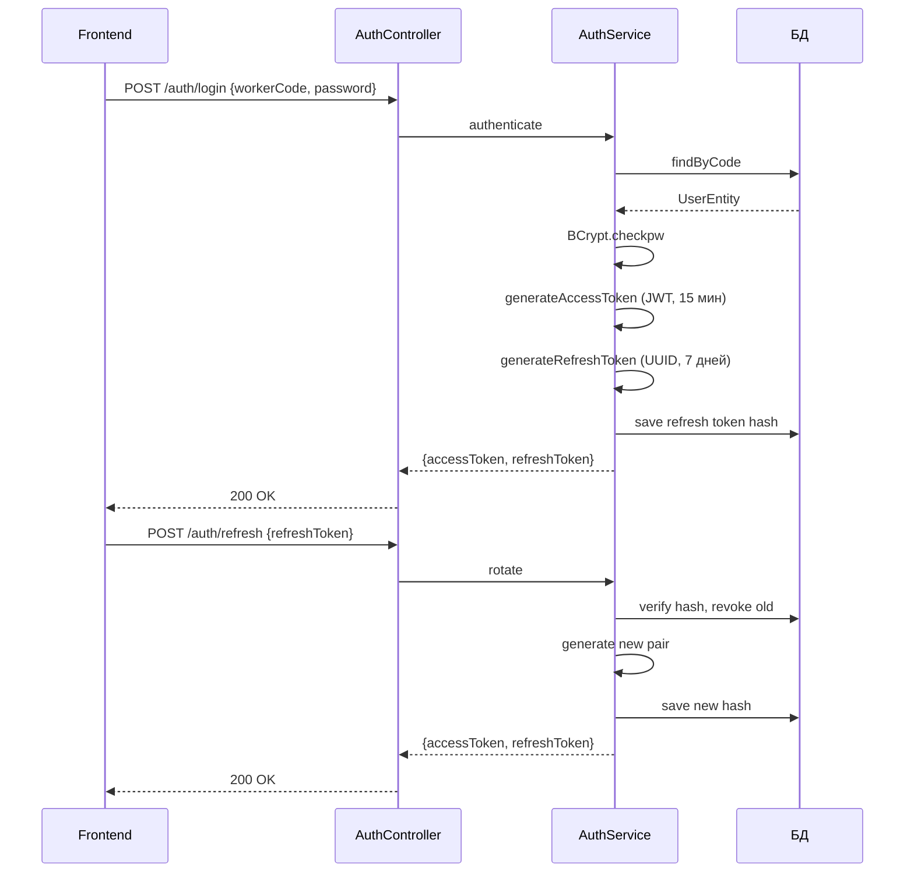
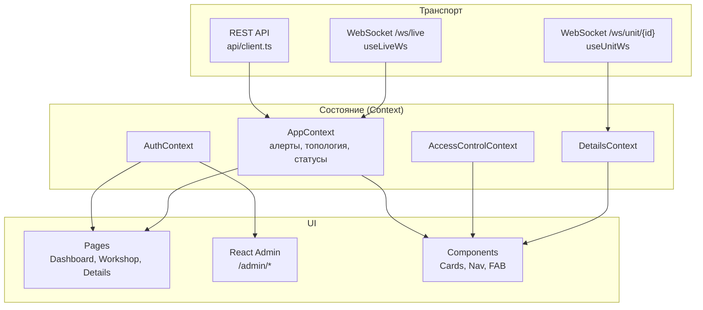

# Диаграмма архитектуры проекта

## Purpose
Фактическая архитектура на основании текущей реализации backend и frontend.

## Table of contents
- [Purpose](#purpose)
- [Общая архитектура](#общая-архитектура)
- [Поток данных в backend](#поток-данных-в-backend)
- [Аутентификация](#аутентификация)
- [Архитектура frontend](#архитектура-frontend)
- [References](#references)

## Общая архитектура

```mermaid
flowchart TB
  subgraph Clients[Клиенты]
    WebPWA["Frontend PWA\nReact + TypeScript\nVite + Tailwind"]
    AndroidTWA["Android TWA\nКонтейнер для PWA"]
  end

  subgraph Backend["Backend: Spring Boot"]
    API["HTTP API\nREST + JWT"]
    WS["WebSocket\nLive updates"]
    Admin["Admin API\n/api/v1.0.0/admin/**"]
    Poller["PrintSrv polling\nTCP client"]
    Domain["Бизнес-логика\nнормализация, алерты"]
    Security["Spring Security\nJWT Resource Server"]
    DB[("PostgreSQL\nпользователи, топология"]
  end

  subgraph External["Внешние системы"]
    PrintSrv["PrintSrv\nисточник тегов"]
  end

  AndroidTWA -->|"отображает"| WebPWA
  WebPWA <-->|"REST + Bearer JWT"| API
  WebPWA <-->|"WebSocket ?token=<jwt>"| WS
  WebPWA <-->|"REST + ADMIN role"| Admin
  API --> Security
  WS --> Security
  Security --> Domain
  API --> Domain
  Admin --> Domain
  Domain --> Poller
  Domain --> DB
  Poller <-->|"TCP socket\nQueryAll каждые 1000мс"| PrintSrv
```

## Поток данных в backend

```mermaid
flowchart LR
    PrintSrv["PrintSrv"] -->|"TCP QueryAll"| Poller["PrintSrvInstancePoller"]
    Poller -->|"DeviceSnapshot"| Snapshot["InMemoryInstanceSnapshotStore"]
    Snapshot -->|"Сырые данные"| UnitDetail["UnitDetailService"]
    Snapshot -->|"Ошибки"| ErrorStore["UnitErrorStore"]
    ErrorStore --> AlertService["AlertService"]
    AlertService --> AlertStore["ActiveAlertStore"]
    AlertStore --> Broadcaster["StatusBroadcaster"]
    Broadcaster -->|"ALERT"| LiveWs["LiveWsHandler\n/ws/live"]
    Broadcaster -->|"UNITS_STATUS"| LiveWs
    UnitDetail -->|"LINE_STATUS\nDEVICES_STATUS\nQUEUE\nERRORS"| UnitWs["UnitWsHandler\n/ws/unit/{unitId}"]
    LiveWs --> Frontend["Frontend"]
    UnitWs --> Frontend
```

## Аутентификация

```mermaid
sequenceDiagram
    participant Client as Frontend
    participant Auth as AuthController
    participant Service as AuthService
    participant DB as БД

    Client->>Auth: POST /auth/login {workerCode, password}
    Auth->>Service: authenticate
    Service->>DB: findByCode
    DB-->>Service: UserEntity
    Service->>Service: BCrypt.checkpw
    Service->>Service: generateAccessToken (JWT, 15 мин)
    Service->>Service: generateRefreshToken (UUID, 7 дней)
    Service->>DB: save refresh token hash
    Service-->>Auth: {accessToken, refreshToken}
    Auth-->>Client: 200 OK

    Client->>Auth: POST /auth/refresh {refreshToken}
    Auth->>Service: rotate
    Service->>DB: verify hash, revoke old
    Service->>Service: generate new pair
    Service->>DB: save new hash
    Service-->>Auth: {accessToken, refreshToken}
    Auth-->>Client: 200 OK
```

## Архитектура frontend

```mermaid
flowchart TB
    subgraph Transport["Транспорт"]
        REST["REST API\napi/client.ts"]
        WS1["WebSocket /ws/live\nuseLiveWs"]
        WS2["WebSocket /ws/unit/{id}\nuseUnitWs"]
    end

    subgraph State["Состояние (Context)"]
        Auth["AuthContext"]
        App["AppContext\nалерты, топология, статусы"]
        Access["AccessControlContext"]
        Details["DetailsContext"]
    end

    subgraph UI["UI"]
        Pages["Pages\nDashboard, Workshop, Details"]
        Admin["React Admin\n/admin/*"]
        Components["Components\nCards, Nav, FAB"]
    end

    REST --> App
    WS1 --> App
    WS2 --> Details
    Auth --> Pages
    App --> Pages
    App --> Components
    Access --> Components
    Details --> Components
    Auth --> Admin
```

## References
- Runtime и polling-процесс: [BACKEND_ARCHITECTURE.md](BACKEND_ARCHITECTURE.md), [BACKEND_DATA_FLOW.md](BACKEND_DATA_FLOW.md).
- Компонентная диаграмма backend: [BACKEND_COMPONENT_DIAGRAM.md](BACKEND_COMPONENT_DIAGRAM.md).
- Контракт REST/WebSocket: [API_REFERENCE.md](API_REFERENCE.md).
- Аутентификация: [AUTH_FLOW.md](AUTH_FLOW.md).
- Архитектура frontend: [FRONTEND_ARCHITECTURE.md](FRONTEND_ARCHITECTURE.md).
- Жизненный цикл алерта: [ALERT_LIFECYCLE.md](ALERT_LIFECYCLE.md).
- Фронтенд-обработка live-сообщений: [frontend/src/hooks/useLiveWs.ts](frontend/src/hooks/useLiveWs.ts).
