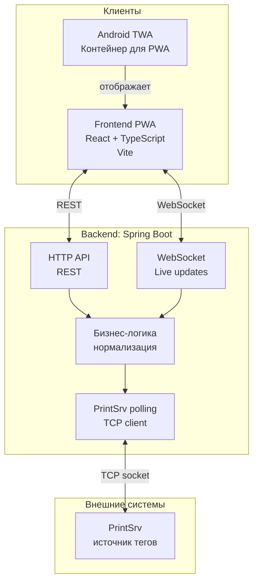

# Диаграмма архитектуры проекта

## Purpose
Фактическая архитектура на основании текущей реализации backend и frontend.

## Table of contents
- [Purpose](#purpose)
- [Current architecture](#current-architecture)
- [References](#references)

## Current architecture

```mermaid
flowchart TB
  subgraph Clients[Клиенты]
    WebPWA["Frontend PWA\nReact + TypeScript\nVite"]
    AndroidTWA["Android TWA\nКонтейнер для PWA"]
  end

  subgraph Backend["Backend: Spring Boot"]
    API["HTTP API\nREST"]
    WS["WebSocket\nLive updates"]
    Poller["PrintSrv polling\nTCP client"]
    Domain["Бизнес-логика\nнормализация"]
  end

  subgraph External["Внешние системы"]
    PrintSrv["PrintSrv\nисточник тегов"]
  end

  AndroidTWA -->|"отображает"| WebPWA
  WebPWA <-->|"REST"| API
  WebPWA <-->|"WebSocket"| WS
  API --> Domain
  WS --> Domain
  Domain --> Poller
  Poller <-->|"TCP socket"| PrintSrv
```

## References
- Runtime и polling-процесс: [BACKEND_ARCHITECTURE.md](BACKEND_ARCHITECTURE.md).
- Контракт REST/WebSocket: [API_REFERENCE.md](API_REFERENCE.md).
- Фронтенд-обработка live-сообщений: [frontend/src/hooks/useLiveWs.ts](frontend/src/hooks/useLiveWs.ts).