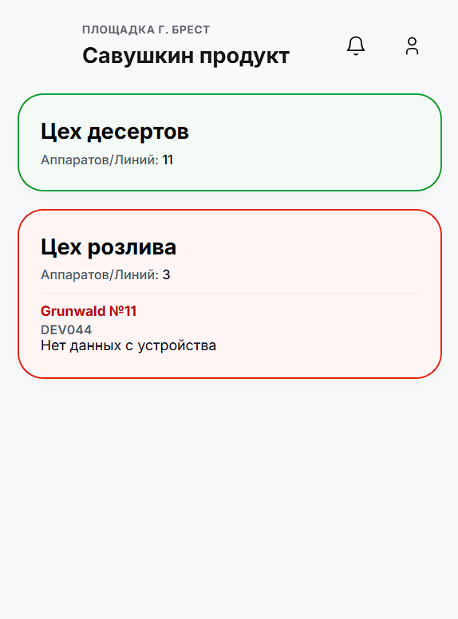
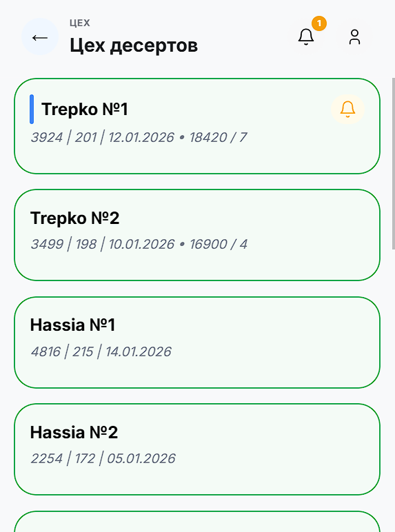
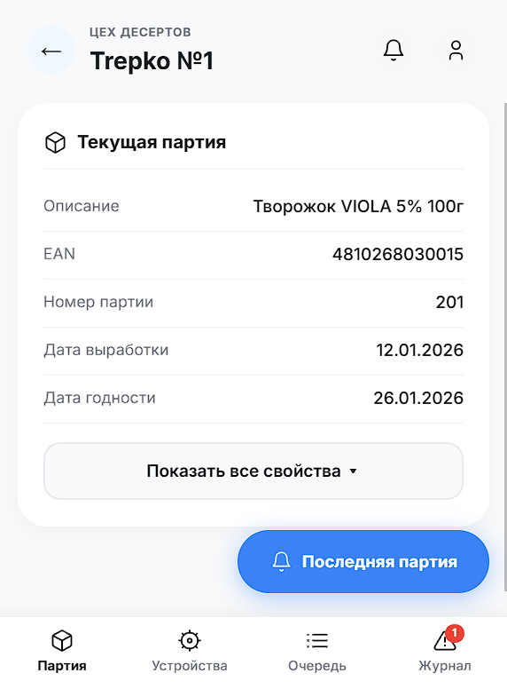
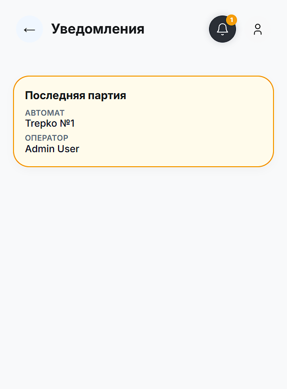

*[Русская версия здесь](README.md)*

# 🥛 SCADA Mobile

## 📌 Description

**SCADA Mobile** is a real-time alerting system that notifies employees of a large dairy plant about downtime and incidents on production lines.

When a line or a machine stops, employees in other workshops often have no idea why (blanks/materials ran out, the operator got distracted, a unit is down) — and the "domino effect" halts packaging, palletizing and shipping. The app quickly tells everyone affected what happened, where, and why the section is down.

The overall pipeline: an event on the equipment → reading via PrintSrv → the Spring backend aggregates and normalizes the event → notifications are dispatched → the web client displays the state.

## 🎯 Core Features

- **Main dashboard** — a list of workshops with their status (OK/problem) and the number of machines and lines.
- **Workshop machines** — machine cards showing current batch data and badges for active notifications.
- **Machine details** — "Batch", "Devices", "Queue", "Log" tabs: current batch (description, EAN, number, production/expiry dates), peripheral status, command queue, error history.
- **Notifications** — call responsible employees right from the machine card; incoming notifications from colleagues with device vibration.
- **Admin panel** — manage employees (roles, personnel numbers, machine assignments) and machines.
- **PWA** — the web client installs on devices and delivers notifications via a Service Worker, no separate native app required.

## 🖼️ Screenshots

<table>
  <tr>
    <td align="center">
      <b>1️⃣ Workshop list</b> 
      
    </td>
    <td align="center">
      <b>2️⃣ Workshop machines</b> 
      
    </td>
  </tr>
  <tr>
    <td align="center">
      <b>3️⃣ Machine details</b> 
      
    </td>
    <td align="center">
      <b>4️⃣ Notifications</b> 
      
    </td>
  </tr>
</table>

## 🛠️ System Components and Technologies

- **[backend](backend)** — Spring Boot 4 / Java 21: REST + WebSocket API, JWT authentication, admin panel API, health checks, PrintSrv integration, Flyway migrations, PostgreSQL.
- **[frontend](frontend)** — React + TypeScript + Vite (PWA), admin panel built on React Admin.
- **Docker** — docker-compose scenarios for production deployment are already in the repository; Kubernetes orchestration on the company intranet is planned.

## 📋 Project Status (August 2026)

- The core parts are up and running: backend, web client (PWA), admin panel, notifications.
- **TWA/Android.** The native wrapper (Bubblewrap) has been removed from the repository: the key requirement (on-device notifications with vibration) is covered by the web client in Chrome via a Service Worker, while a full TWA requires strict HTTPS inside the corporate network, which is organizationally difficult. It remains a potential option for the future.
- **Kafka migration is planned.** Direct TCP polling of PrintServer will be replaced by reading from Kafka — polling is taken over by a dedicated Gateway. See [ТЗ_миграция_на_Kafka.md](ТЗ_миграция_на_Kafka.md) and [ТЗ_Gateway_Якимовец.md](ТЗ_Gateway_Якимовец.md) (in Russian).

## 🚀 Quick Local Start

### Prerequisites

- Java 21+
- Node.js 20+ and npm
- Docker Desktop (production mode only)

### Option 1. Run components separately (recommended for development)

1. Start the backend: `make back-run`.
2. In another terminal, install frontend dependencies (once): `make front-install`.
3. Start the frontend: `make front-dev`.
4. Open in a browser:
   - Frontend: <http://localhost:5500>
   - Backend health: <http://localhost:8080/api/v1.0.0/health/live>
   - Swagger UI (dev): <http://localhost:8080/swagger-ui.html>

### Option 2. Run in Docker (production only)

Start: `make docker-prod-up`. Stop: `make docker-prod-down`.

Details on Docker, the prod profile and env files: [RUN_PROJECT_DOCKER.md](RUN_PROJECT_DOCKER.md).

Full list of shortcuts: `make help` (see [MAKEFILE.md](MAKEFILE.md)).

## 📚 Documentation

To avoid duplicating information, the details are split across separate files (mostly in Russian):

- [STRUCTURE.md](STRUCTURE.md) — project architecture and technology stack;
- [PROJECT_DIAGRAM.md](PROJECT_DIAGRAM.md) — visual system diagrams;
- [API_REFERENCE.md](API_REFERENCE.md) — REST and WebSocket contract;
- [FRONTEND_API.md](FRONTEND_API.md) — overview of frontend API usage;
- [FRONTEND_DATA_SOURCES.md](FRONTEND_DATA_SOURCES.md) — where the backend gets data for the frontend;
- [FRONTEND_ARCHITECTURE.md](FRONTEND_ARCHITECTURE.md) — frontend architecture;
- [NOTIFICATIONS_ARCHITECTURE.md](NOTIFICATIONS_ARCHITECTURE.md) — notification logic;
- [api_mapping.md](api_mapping.md) — transport separation and mapping;
- [BACKEND_ARCHITECTURE.md](BACKEND_ARCHITECTURE.md) — actual backend architecture;
- [BACKEND_COMPONENT_DIAGRAM.md](BACKEND_COMPONENT_DIAGRAM.md) — backend component diagram;
- [BACKEND_DATA_FLOW.md](BACKEND_DATA_FLOW.md) — backend data flow;
- [AUTH_FLOW.md](AUTH_FLOW.md) — authentication and authorization;
- [ALERT_LIFECYCLE.md](ALERT_LIFECYCLE.md) — alert lifecycle;
- [SECURITY.md](SECURITY.md) — security policy and JWT;
- [TEST_ACCOUNTS.md](TEST_ACCOUNTS.md) — test accounts and data for checks;
- [MAKEFILE.md](MAKEFILE.md) — development and run commands;
- [frontend/README.md](frontend/README.md) — web client details and frontend commands.
