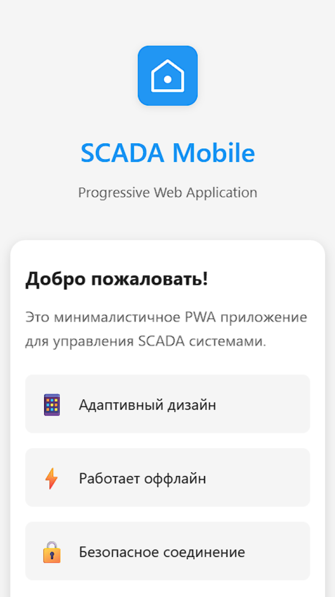

# SCADA Mobile

Проект дипломной работы: мобильное SCADA-приложение для мониторинга и управления, ориентированное на Android. Концепция — PWA (веб‑приложение) + TWA (Android‑оболочка), а серверная часть будет добавлена отдельно.

## Статус

⚠️ Проект находится в активной разработке.

- Сервер (Java/Spring) **ещё не реализован** — папка [backend/](backend/) пока пустая заготовка.
- Веб‑часть в [frontend/](frontend/) — **тестовый статический PWA**, предназначенный для проверки связки PWA↔TWA (manifest, service worker, offline‑кэш, assetlinks).
- Android‑оболочка в [android/](android/) — TWA‑контейнер, который запускает веб‑приложение.

Основной актуальный документ по целевой архитектуре и правилам разработки: [STRUCTURE.md](STRUCTURE.md).

## Что уже есть в репозитории

- [frontend/](frontend/) — статический PWA (HTML/CSS/JS) + Service Worker + Web Manifest.
- [android/](android/) — TWA‑проект (Gradle) для упаковки PWA в Android‑приложение.
- [backend/](backend/) — место под будущий Spring Boot сервер.

Подробности по текущим папкам см. в:

- [frontend/README.md](frontend/README.md)
- [android/README.md](android/README.md)

## Целевая архитектура (кратко)

Полная версия — [STRUCTURE.md](STRUCTURE.md). Ключевые принципы:

- Frontend: только UI и состояние, без секретов и бизнес‑логики.
- Backend: вся бизнес‑логика, авторизация, валидация, маппинг, real‑time (WebSocket).
- Ошибки API: единый формат **Problem+JSON (RFC 7807)**, централизованно через `@ControllerAdvice`.

## Быстрая проверка текущего прототипа

Сейчас репозиторий предназначен прежде всего для проверки связки PWA + TWA.

### Запуск PWA локально

```bash
cd frontend
python -m http.server 8000
```

Открыть: `http://localhost:8000/`.

### Android (TWA)

Сборка/запуск Android‑оболочки описаны в [android/README.md](android/README.md).

## Безопасность

- Не коммитьте секреты: токены, пароли, ключи, файлы keystore (`*.jks`, `*.keystore`) и т.п.
- В Android‑части ключи подписи должны храниться вне репозитория (локально или в защищённом хранилище CI).
- Любые production‑значения (URL, отпечатки сертификатов, ключи) должны настраиваться через переменные окружения/секреты CI и локальные файлы, игнорируемые Git.

## План работ в общих чертах

- Реализовать Spring Boot backend (API + WebSocket) и интеграцию с сервером маркировки (PrintSrv).
- Перевести веб‑часть от тестового PWA к полноценному UI (React/TS) согласно [STRUCTURE.md](STRUCTURE.md).
- Стабилизировать процессы CI/CD, генерацию OpenAPI → TypeScript типов, единый формат ошибок.

**Детали:** Информация о сборке, настройке Digital Asset Links, подписании APK и деплою находятся в файле `twa-mobile/README.md`.

---

## 6. Тестирование Приложения

### 6.1. Загрузка и Установка APK

Для облегчения тестирования преподавателем и другими пользователями, **APK-файл приложения доступен в релизах репозитория** и готов к установке на любое Android-устройство.

**Для установки:**

1. Загрузите актуальный APK с [Releases](https://github.com/savushkin-dev/scada-mobile/releases/latest/download/app-release-signed.apk) раздела этого репозитория
2. Передайте APK на Android-устройство (через email, облако, Bluetooth, кабель и т.д.)
3. На устройстве откройте файловый менеджер, найдите APK и нажмите установку
4. Подтвердите установку (может потребоваться разрешение на установку из неизвестных источников в настройках)
5. Приложение появится на главном экране
6. Запустите и протестируйте функциональность

### 6.2. Испытание Функциональности

После установки рекомендуется проверить:

- **Запуск приложения:** Приложение должно открываться без адресной строки браузера
- **Отображение данных:** Приложение должно корректно отображать данные SCADA в реальном времени
- **Офлайн режим:** Если отключить интернет, ранее загруженные данные должны оставаться видны благодаря Service Worker
- **Ответ сервера:** Проверьте, что приложение получает актуальные данные с сервера при наличии соединения

---

## 7. Скриншоты

Приложение в работе на мобильном устройстве:



Приложение в работе на десктопе:


---

### Заключение

PWA + TWA является идеальным, **минималистичным и дальновидным** выбором для данного проекта. Он обеспечивает **высокую производительность**, **моментальные обновления** и **100% единую кодовую базу** при сохранении возможности будущего расширения функционала на уровне устройства, полностью соответствуя бизнес-требованию оперативного и экономически эффективного внедрения.
