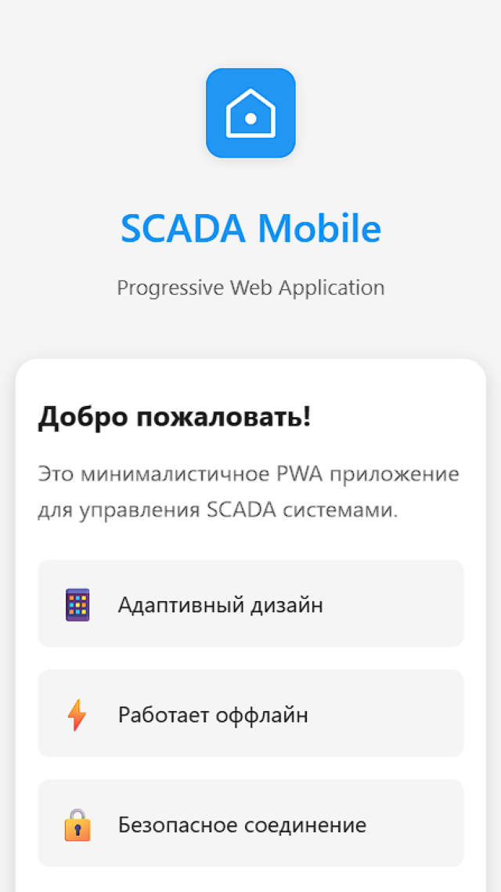

# SCADA Mobile

Проект дипломной работы: мобильное SCADA-приложение для мониторинга и управления, ориентированное на Android. Концепция — PWA (веб‑приложение) + TWA (Android‑оболочка), а серверная часть будет добавлена отдельно.

## Быстрый запуск локально

### Требования

- Java 21+
- Gradle (обёртка `gradlew` уже в репозитории)
- Любой статический HTTP-сервер для фронта (Live Server, python http.server и т.д.)

### 1. Запуск бекенда

```bash
make back-run-bg
```

Бекенд запустится в фоне с dev-профилем на `http://localhost:8080`.

Проверить статус: `make back-status`  
Остановить: `make back-stop`  
Логи: `backend/logs/backend.log`

### 2. Открыть фронтенд

Откройте `frontend/index.html` через Live Server (порт 5500) или любым другим способом:

```bash
cd frontend
python -m http.server 5500
```

Затем открыть: [http://localhost:5500](http://localhost:5500)

Фронтенд автоматически направит API-запросы на `localhost:8080`.

> **Примечание:** используйте порт 5500 — он включён в CORS-allowlist dev-профиля бекенда. При использовании Live Server в VS Code порт 5500 устанавливается автоматически.

### После запуска:

- Frontend: [http://localhost:5500](http://localhost:5500)
- Backend API: [http://localhost:8080/api/v1/commands/queryAll](http://localhost:8080/api/v1/commands/queryAll)
- Backend Health: [http://localhost:8080/api/v1/commands/health/live](http://localhost:8080/api/v1/commands/health/live)
- Swagger UI (только dev): [http://localhost:8080/swagger-ui.html](http://localhost:8080/swagger-ui.html)

## Статус

⚠️ Проект находится в активной разработке.

- Сервер в [backend/](backend/) реализован на Spring Boot и предоставляет REST API для чтения и отправки команд.
- Веб‑часть в [frontend/](frontend/) — рабочий минимальный PWA-клиент (HTML/CSS/JS) для ручного чтения/установки значений.
- Android‑оболочка в [android/](android/) — TWA‑контейнер, который запускает веб‑приложение.

**Основные документы проекта:**

- [STRUCTURE.md](STRUCTURE.md) — целевая архитектура и правила разработки
- [PROJECT_DIAGRAM.md](PROJECT_DIAGRAM.md) — визуальные диаграммы архитектуры и структуры репозитория (Mermaid)

## Что уже есть в репозитории

- [frontend/](frontend/) — статический PWA (HTML/CSS/JS) + Service Worker + Web Manifest. *Текущее состояние — заглушка; целевая архитектура (React/TS) описана в [STRUCTURE.md](STRUCTURE.md).*
- [android/](android/) — TWA‑проект (Gradle) для упаковки PWA в Android‑приложение.
- [backend/](backend/) — Spring Boot сервер (REST API, health endpoints, интеграция с PrintSrv).

Подробности по текущим папкам см. в:

- [frontend/README.md](frontend/README.md)
- [android/README.md](android/README.md)

## Целевая архитектура

Полная версия — [STRUCTURE.md](STRUCTURE.md). Визуальные диаграммы — [PROJECT_DIAGRAM.md](PROJECT_DIAGRAM.md).

## Безопасность

Политика безопасности проекта — в [SECURITY.md](SECURITY.md).

## План работ

Детальный план разработки по фазам — [PLAN.md](PLAN.md). Бизнес-цели — [PLAN_BUSINESS.md](PLAN_BUSINESS.md).

---

## Тестирование Приложения

Инструкции по загрузке, установке и тестированию APK — в [android/README.md](android/README.md).

---

## Скриншоты

Приложение в работе на мобильном устройстве:



Приложение в работе на десктопе:


---
