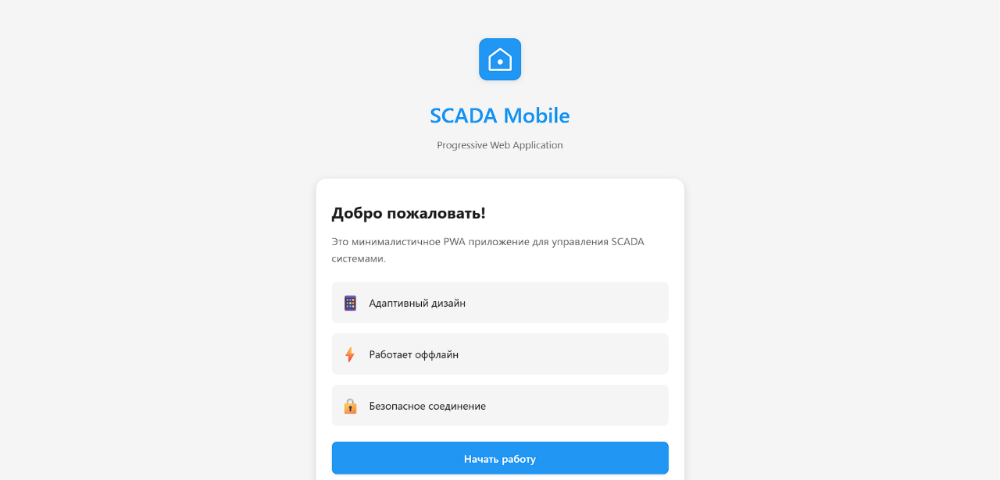

# SCADA Mobile

SCADA Mobile — это система оповещений для производства.
Когда линия или оборудование останавливается, система быстро показывает сотрудникам, что произошло, где это произошло и что с этим сейчас.

Проще говоря:

- backend получает сигналы от источников данных и формирует понятные события;
- frontend показывает состояние цехов и оборудования в удобном интерфейсе;
- Android-приложение запускает тот же веб-интерфейс в формате TWA.

## Purpose

Короткий вход в проект, быстрый запуск и ссылки на основные документы.

## Table of contents

- [SCADA Mobile](#scada-mobile)
  - [Purpose](#purpose)
  - [Table of contents](#table-of-contents)
  - [Состояние проекта (май 2026)](#состояние-проекта-май-2026)
  - [Быстрый локальный запуск](#быстрый-локальный-запуск)
    - [Что нужно установить](#что-нужно-установить)
    - [Вариант 1. Запуск по частям (удобно для разработки)](#вариант-1-запуск-по-частям-удобно-для-разработки)
    - [Вариант 2. Запуск в Docker](#вариант-2-запуск-в-docker)
    - [Полезная команда](#полезная-команда)
  - [Куда смотреть за подробностями](#куда-смотреть-за-подробностями)
  - [Скриншоты](#скриншоты)

## Состояние проекта (май 2026)

Проект в активной разработке, но базовые части уже работают:

- [backend](backend) — Spring Boot сервис с REST/WebSocket API, health-check и интеграцией с PrintSrv;
- [frontend](frontend) — React + TypeScript + Vite PWA-клиент;
- [android](android) — TWA-оболочка для запуска веб-клиента на Android;
- Docker-сценарии для dev/prod запуска уже в репозитории.

## Быстрый локальный запуск

### Что нужно установить

- Java 21+
- Node.js 20+ и npm
- Docker Desktop (только если хотите запуск через контейнеры)

### Вариант 1. Запуск по частям (удобно для разработки)

1. Запустите backend: `make back-run`.

2. В другом терминале установите зависимости frontend (один раз): `make front-install`.

3. Запустите frontend: `make front-dev`.

4. Откройте в браузере:

- Frontend: <http://localhost:5500>
- Backend health: <http://localhost:8080/api/v1.0.0/health/live>
- Swagger UI (dev): <http://localhost:8080/swagger-ui.html>

### Вариант 2. Запуск в Docker

Запуск: `make docker-dev-up`.

Остановить: `make docker-dev-down`.

Подробно про Docker, dev/prod профили и env-файлы: [RUN_PROJECT_DOCKER.md](RUN_PROJECT_DOCKER.md).

### Полезная команда

Полный список шорткатов: `make help` (см. [MAKEFILE.md](MAKEFILE.md)).

## Куда смотреть за подробностями

Чтобы не дублировать информацию, вся детализация разнесена по отдельным файлам:

- [STRUCTURE.md](STRUCTURE.md) — архитектура проекта и технологический стек;
- [PROJECT_DIAGRAM.md](PROJECT_DIAGRAM.md) — визуальные схемы системы;
- [API_REFERENCE.md](API_REFERENCE.md) — контракт REST и WebSocket;
- [FRONTEND_API.md](FRONTEND_API.md) — краткий обзор фронтенд-использования API;
- [FRONTEND_DATA_SOURCES.md](FRONTEND_DATA_SOURCES.md) — откуда backend берет данные для фронтенда;
- [NOTIFICATIONS_ARCHITECTURE.md](NOTIFICATIONS_ARCHITECTURE.md) — логика уведомлений;
- [api_mapping.md](api_mapping.md) — разделение транспортов и маппинг;
- [BACKEND_ARCHITECTURE.md](BACKEND_ARCHITECTURE.md) — фактическая архитектура backend;
- [MAKEFILE.md](MAKEFILE.md) — команды разработки и запуска;
- [frontend/README.md](frontend/README.md) — детали веб-клиента и фронтенд-команд;
- [android/README.md](android/README.md) — сборка и запуск Android TWA;
- [SECURITY.md](SECURITY.md) — правила безопасности и секретов;
- [PLAN.md](PLAN.md) и [PLAN_BUSINESS.md](PLAN_BUSINESS.md) — технический и бизнес-план.

## Скриншоты

Приложение на мобильном устройстве:

Приложение на десктопе:

