*[English version here](README.en.md)*

# 🥛 SCADA Mobile

## 📌 Описание

**SCADA Mobile** — система оперативного оповещения сотрудников крупного молочного предприятия о простоях и ЧП на производственных линиях.

Когда линия или оборудование останавливается, сотрудники в других цехах часто не понимают причину (закончились заготовки/материалы, оператор отвлёкся, узел стоит) — и «эффект домино» останавливает упаковку, палетирование и отгрузку. Приложение быстро доносит всем заинтересованным сотрудникам, что произошло, где и почему участок стоит.

Общий пайплайн: событие на оборудовании → считывание через PrintSrv → backend на Spring агрегирует и нормализует событие → рассылка уведомлений → отображение в веб-клиенте.

## 🎯 Возможности

- **Главная панель** — список цехов с состоянием (норма/проблема) и количеством аппаратов и линий.
- **Автоматы цеха** — карточки автоматов с данными текущей партии и значками активных уведомлений.
- **Карточка автомата** — вкладки «Партия», «Устройства», «Очередь», «Журнал»: текущая партия (описание, EAN, номер, даты выработки/годности), состояние периферии, очередь команд, история ошибок.
- **Уведомления** — вызов ответственных сотрудников прямо с карточки автомата; входящие уведомления от других сотрудников с вибрацией на устройстве.
- **Админ-панель** — управление сотрудниками (роли, табельные номера, привязка автоматов) и автоматами.
- **PWA** — веб-клиент устанавливается на устройство и доставляет уведомления через Service Worker, без отдельного нативного приложения.

## 🖼️ Скриншоты

<table>
  <tr>
    <td align="center">
      <b>1️⃣ Список цехов</b> 
      
    </td>
    <td align="center">
      <b>2️⃣ Автоматы цеха</b> 
      
    </td>
  </tr>
  <tr>
    <td align="center">
      <b>3️⃣ Список автоматов внутри цеха</b> 
      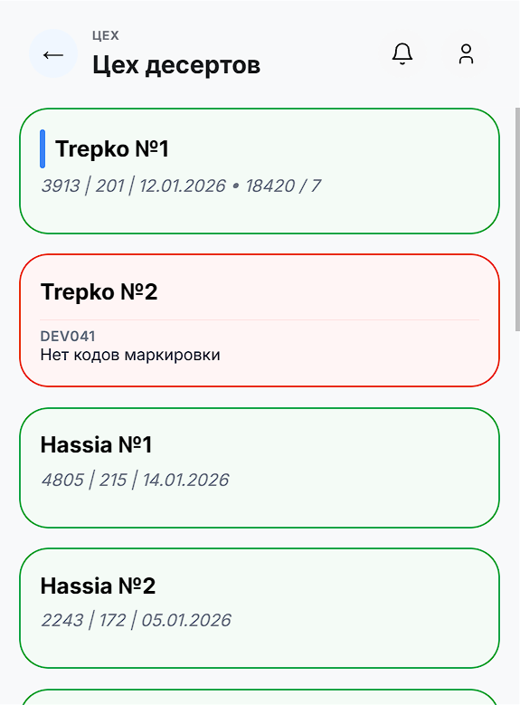
    </td>
    <td align="center">
      <b>4️⃣ Вызов уведомления ответственным</b> 
      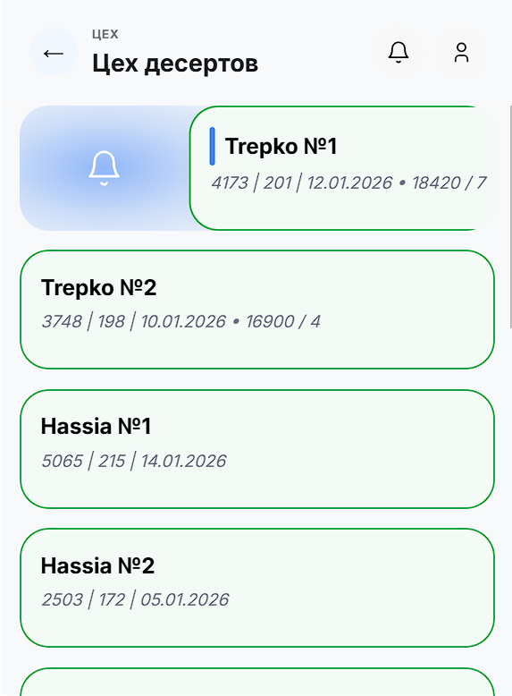
    </td>
  </tr>
  <tr>
    <td align="center">
      <b>5️⃣ Карточка автомата, вкладка «Партия»</b> 
      
    </td>
    <td align="center">
      <b>6️⃣ Вкладка «Партия» с включённым уведомлением</b> 
      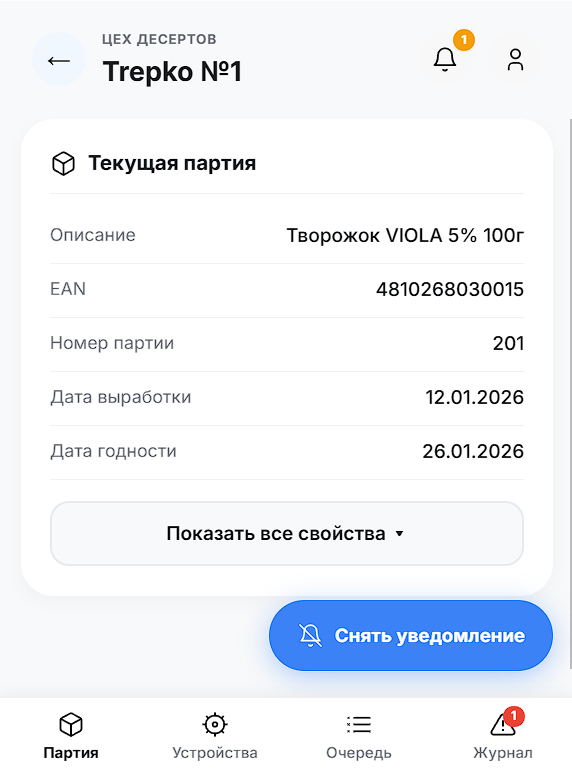
    </td>
  </tr>
  <tr>
    <td align="center">
      <b>7️⃣ Вкладка «Устройства»</b> 
      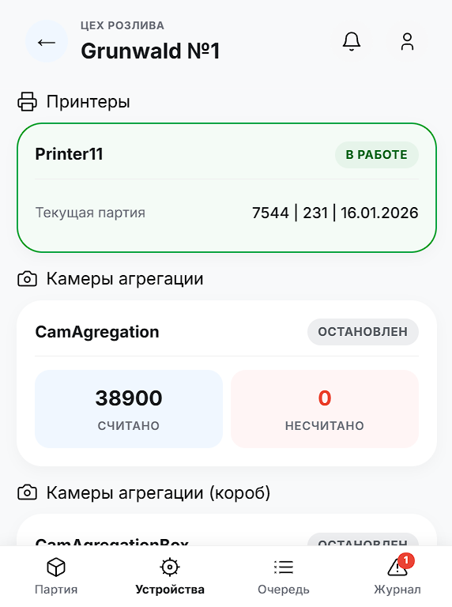
    </td>
    <td align="center">
      <b>8️⃣ Вкладка «Очередь»</b> 
      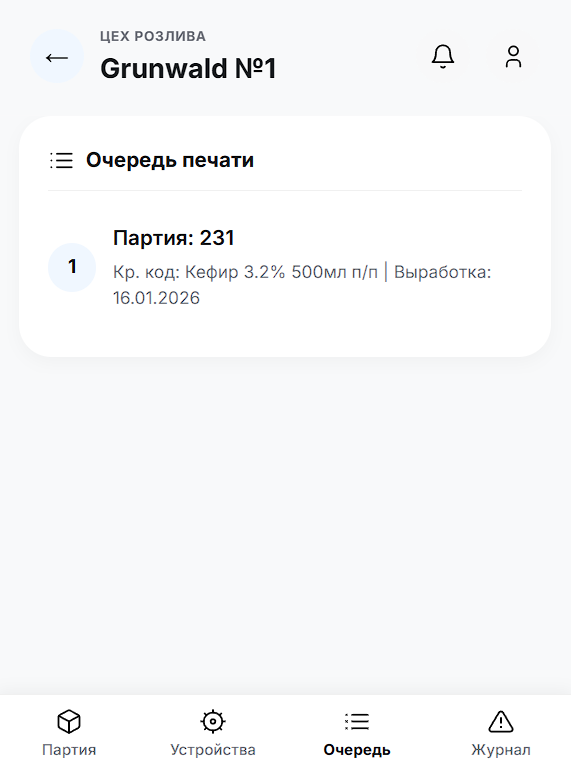
    </td>
  </tr>
  <tr>
    <td align="center">
      <b>9️⃣ Вкладка «Ошибки», без ошибок</b> 
      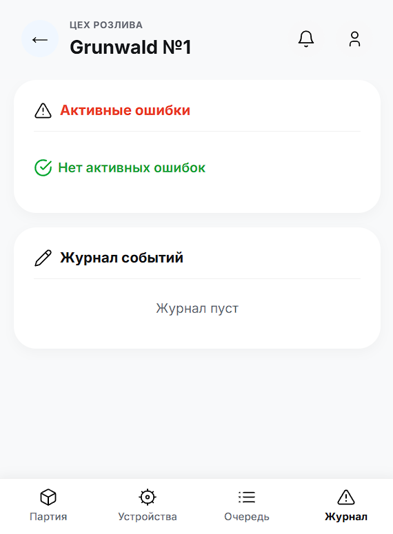
    </td>
    <td align="center">
      <b>🔟 Вкладка «Ошибки» с активной ошибкой</b> 
      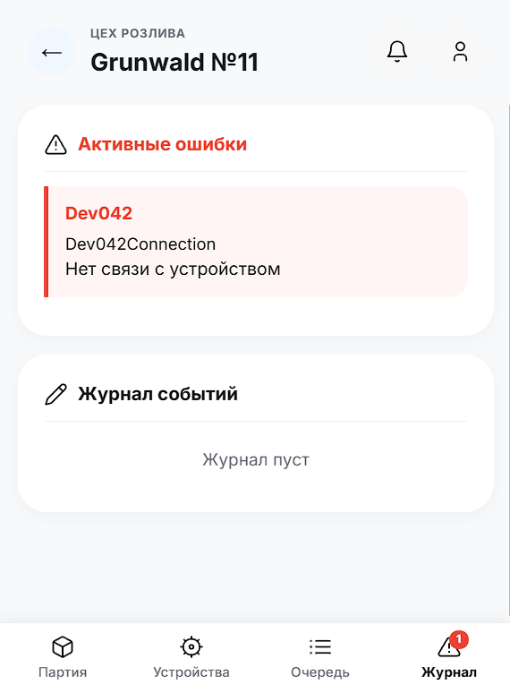
    </td>
  </tr>
  <tr>
    <td align="center">
      <b>1️⃣1️⃣ Подтверждение уведомления</b> 
      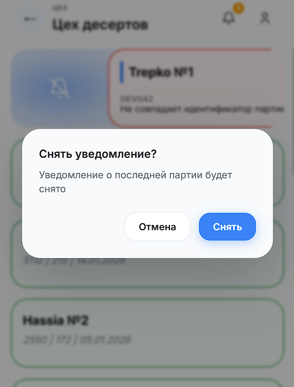
    </td>
    <td align="center">
      <b>1️⃣2️⃣ Вкладка уведомлений</b> 
      
    </td>
  </tr>
  <tr>
    <td align="center">
      <b>1️⃣3️⃣ Уведомления от сотрудников (пусто)</b> 
      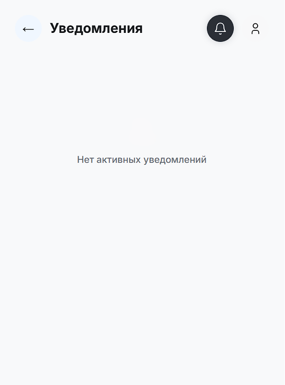
    </td>
    <td align="center">
      <b>1️⃣4️⃣ Экран входа</b> 
      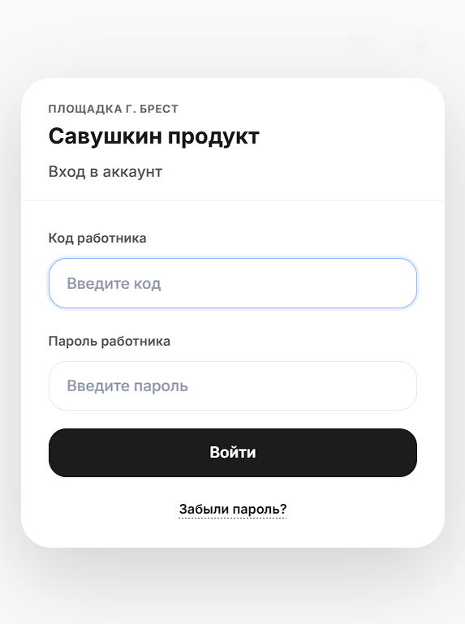
    </td>
  </tr>
  <tr>
    <td align="center">
      <b>1️⃣5️⃣ Страница пользователя</b> 
      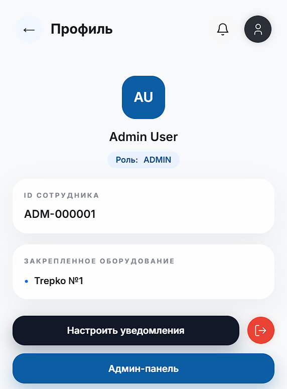
    </td>
    <td align="center">
      <b>1️⃣6️⃣ Настройки уведомлений пользователя</b> 
      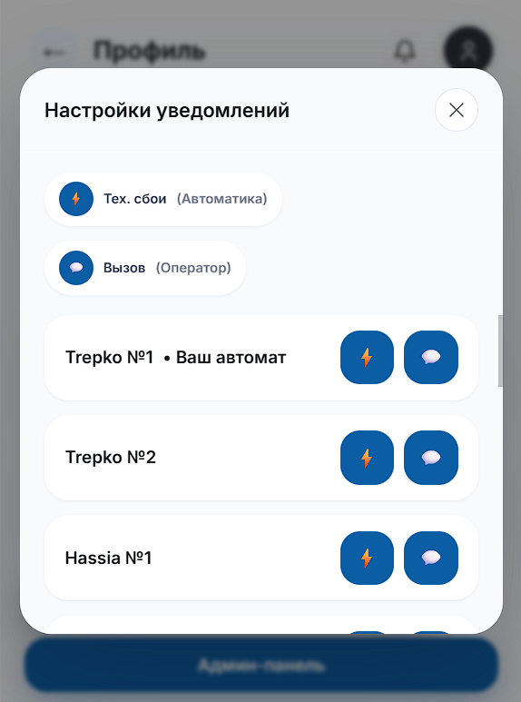
    </td>
  </tr>
  <tr>
    <td align="center">
      <b>1️⃣7️⃣ Админ-панель: главная страница</b> 
      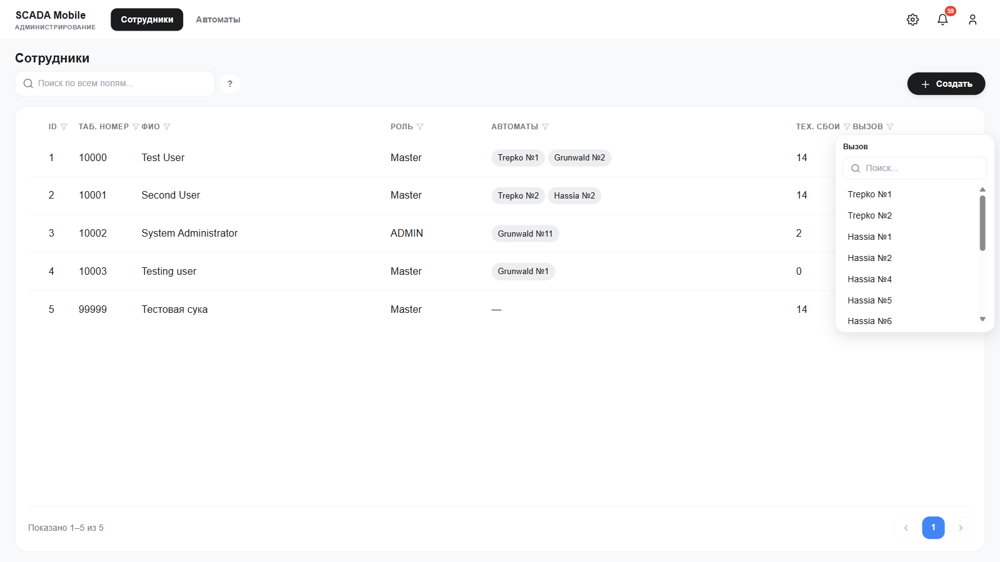
    </td>
    <td></td>
  </tr>
</table>

## 🛠️ Состав системы и технологии

- **[backend](backend)** — Spring Boot 4 / Java 21: REST + WebSocket API, JWT-аутентификация, API админ-панели, health-check, интеграция с PrintSrv, Flyway-миграции, PostgreSQL.
- **[frontend](frontend)** — React + TypeScript + Vite (PWA), админка на React Admin.
- **Docker** — docker-compose сценарии для prod-запуска уже в репозитории; в планах оркестрация (Kubernetes) во внутренней сети компании.

## 📋 Состояние проекта (август 2026)

- Базовые части работают: backend, веб-клиент (PWA), админ-панель, уведомления.
- **TWA/Android.** Нативная оболочка (Bubblewrap) выведена из репозитория: ключевая потребность (уведомления на устройствах с вибрацией) закрывается веб-клиентом в Chrome через Service Worker, а для полноценного TWA в корпоративной сети требуется строгий HTTPS, что организационно сложно. Остаётся потенциальной опцией на будущее.
- **Планируется миграция на Kafka.** Прямой TCP-опрос PrintServer заменяется чтением из Kafka — опрос берёт на себя отдельный Gateway. См. [ТЗ_миграция_на_Kafka.md](ТЗ_миграция_на_Kafka.md) и [ТЗ_Gateway_Якимовец.md](ТЗ_Gateway_Якимовец.md).

## 🚀 Быстрый локальный запуск

### Что нужно установить

- Java 21+
- Node.js 20+ и npm
- Docker Desktop (только для prod режима)

### Вариант 1. Запуск по частям (рекомендуемый для разработки)

1. Запустите backend: `make back-run`.
2. В другом терминале установите зависимости frontend (один раз): `make front-install`.
3. Запустите frontend: `make front-dev`.
4. Откройте в браузере:
   - Frontend: <http://localhost:5500>
   - Backend health: <http://localhost:8080/api/v1.0.0/health/live>
   - Swagger UI (dev): <http://localhost:8080/swagger-ui.html>

### Вариант 2. Запуск в Docker (только prod)

Запуск: `make docker-prod-up`. Остановка: `make docker-prod-down`.

Подробно про Docker, prod-профиль и env-файлы: [RUN_PROJECT_DOCKER.md](RUN_PROJECT_DOCKER.md).

Полный список шорткатов: `make help` (см. [MAKEFILE.md](MAKEFILE.md)).

## 📚 Документация

Чтобы не дублировать информацию, детализация разнесена по отдельным файлам:

- [STRUCTURE.md](STRUCTURE.md) — архитектура проекта и технологический стек;
- [PROJECT_DIAGRAM.md](PROJECT_DIAGRAM.md) — визуальные схемы системы;
- [API_REFERENCE.md](API_REFERENCE.md) — контракт REST и WebSocket;
- [FRONTEND_API.md](FRONTEND_API.md) — краткий обзор фронтенд-использования API;
- [FRONTEND_DATA_SOURCES.md](FRONTEND_DATA_SOURCES.md) — откуда backend берёт данные для фронтенда;
- [FRONTEND_ARCHITECTURE.md](FRONTEND_ARCHITECTURE.md) — архитектура frontend;
- [NOTIFICATIONS_ARCHITECTURE.md](NOTIFICATIONS_ARCHITECTURE.md) — логика уведомлений;
- [api_mapping.md](api_mapping.md) — разделение транспортов и маппинг;
- [BACKEND_ARCHITECTURE.md](BACKEND_ARCHITECTURE.md) — фактическая архитектура backend;
- [BACKEND_COMPONENT_DIAGRAM.md](BACKEND_COMPONENT_DIAGRAM.md) — компонентная диаграмма backend;
- [BACKEND_DATA_FLOW.md](BACKEND_DATA_FLOW.md) — поток данных в backend;
- [AUTH_FLOW.md](AUTH_FLOW.md) — аутентификация и авторизация;
- [ALERT_LIFECYCLE.md](ALERT_LIFECYCLE.md) — жизненный цикл алерта;
- [SECURITY.md](SECURITY.md) — политика безопасности и JWT;
- [TEST_ACCOUNTS.md](TEST_ACCOUNTS.md) — тестовые аккаунты и данные для проверок;
- [MAKEFILE.md](MAKEFILE.md) — команды разработки и запуска;
- [frontend/README.md](frontend/README.md) — детали веб-клиента и фронтенд-команд.
