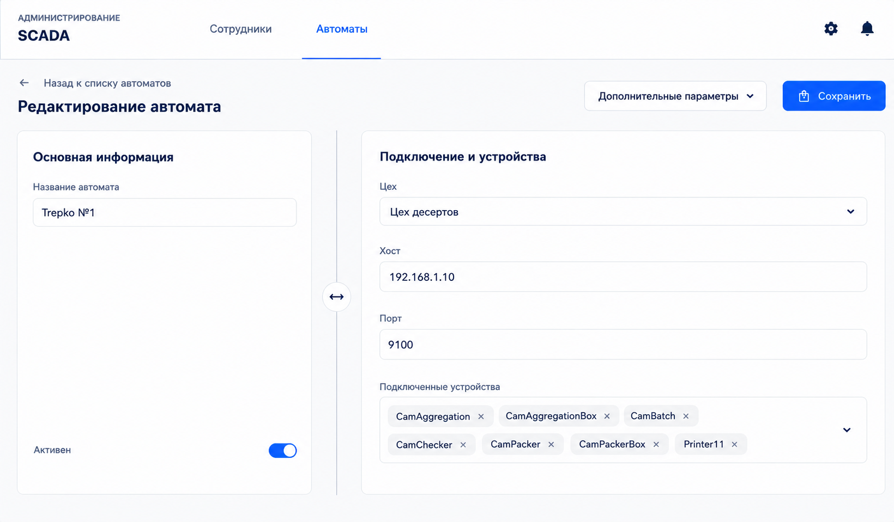
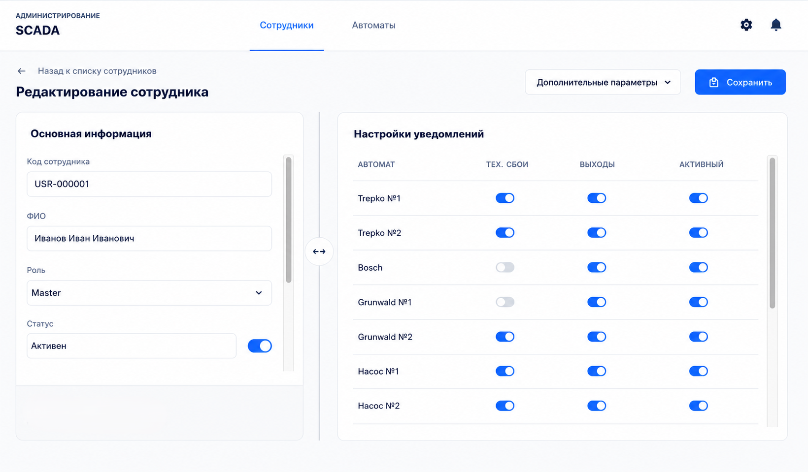
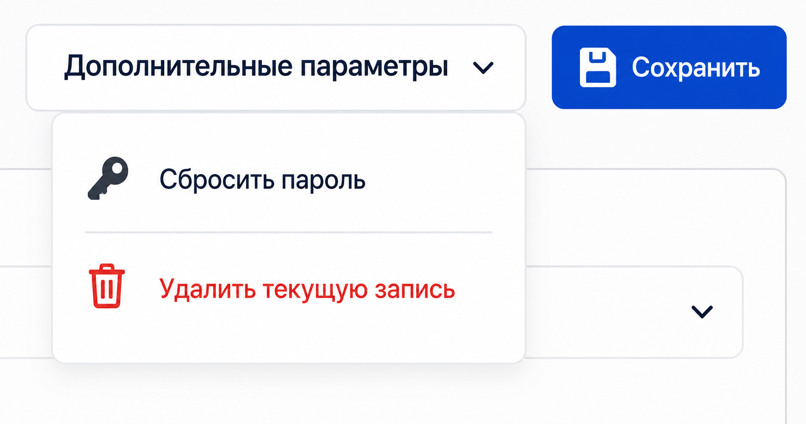
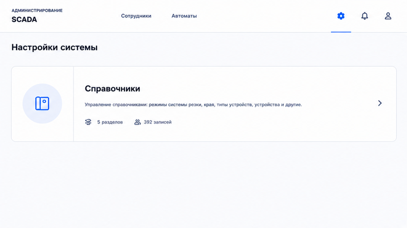
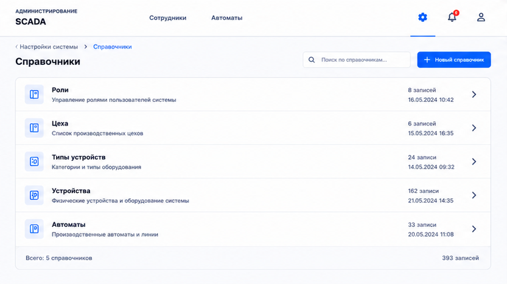
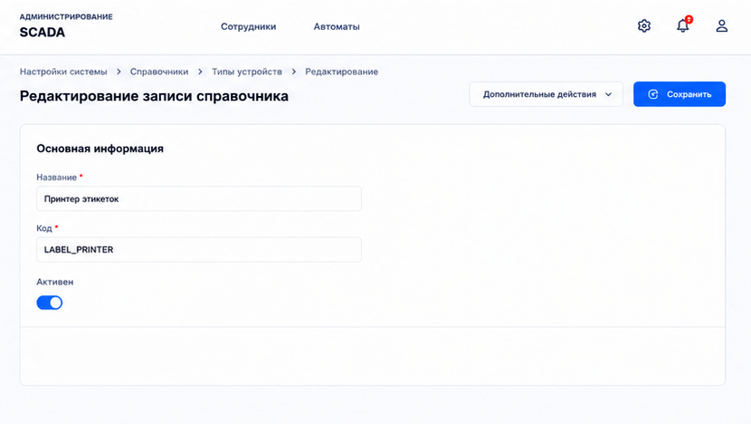
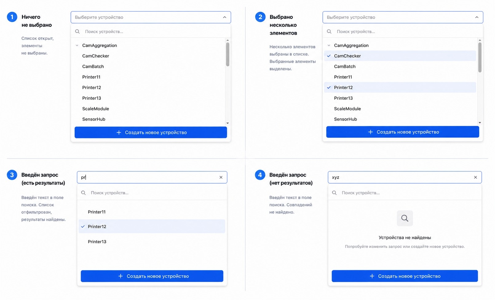
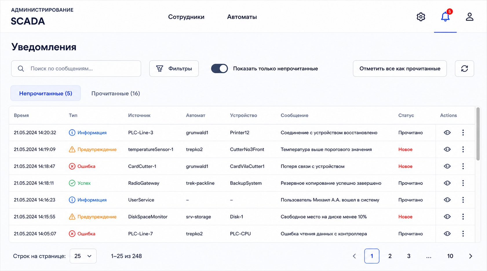
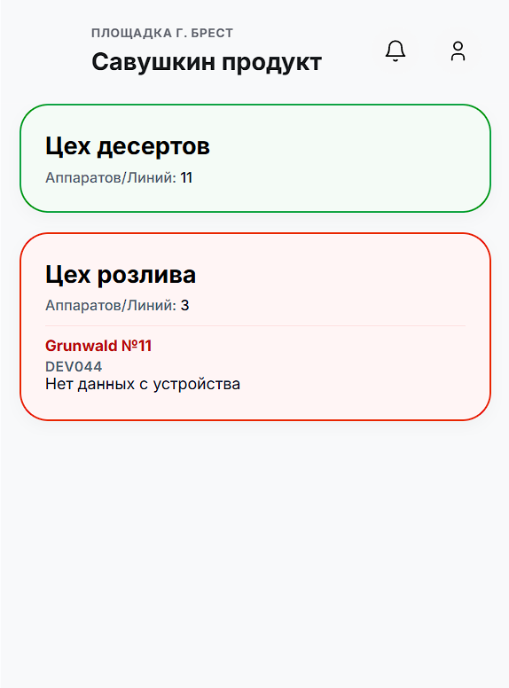
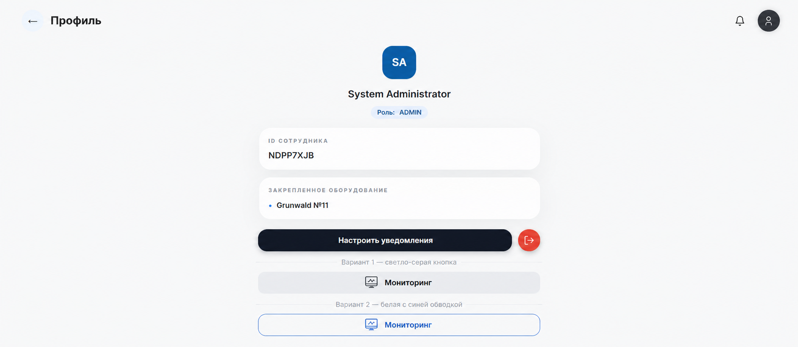

# Рефакторинг административной панели

Этот документ содержит словесное описание требований по редизайну админ панели.

## Референсы

В качестве референсов используются фотографии из папки [рефакторинг-админ-панели](/рефакторинг-админ-панели/).

> **Эти фото дял вдохновления, они не задают жесткие требования по стилю и цвету, а задают жесткие требования только к UX (логике расположения элементов, их функцилональности). При рефакторинге следует равняться только на словесное описание в данном документе - он источник правды.**

## Описание изменений и требований

### Тезисное представление

В таблице ниже представлено краткие тезисные требования:

|  | № | Задача | Область | Приоритет |
| --- | --- | --- | --- | --- |
|  | 1 | Логин по табельному номеру вместо автогенерируемого кода (согласовать формат/валидацию с беком, миграция). Табельный номер сотрудника - код из 5 цифр (например 13390) | Аутентификация | P0 |
|  | 2 | Sticky headers на всех таблицах со списками | Таблицы | P0 |
|  | 3 | Поиск + фильтрация по нескольким полям на списках (после sticky headers) | Таблицы | P0 |
|  | 4 | Редизайн UI/UX админ-панели целиком (референс скриншоты, сгенерированные ChatGPT) | Редизайн | **P0 — основная цель** |
|  | 5 | Убрать «Удалить» со страниц редактирования, перенести в менее заметное место | Формы | P1 |
|  | 6 | Оптимизация пространства на десктопе (шапка и др.) — согласовать с редизайном (п.4) | Лейаут | P1 |

### Детальное описание

Как только человек попадает на страницу входа, он вводит код (логин) и пароль, а потом абсолютно всегда попадает на главную страницу (`http://localhost:5500/`). Теперь делаем так, когда человек входит в аккаунт, в зависимости от роли открывать либо главную страницу, либо панель администратора (`http://localhost:5500/admin`, по умолчанию перенаправляет на `http://localhost:5500/admin/roles`). Я не знаю, как правильно это сделать, подумай сам.
Дальше буду описывать изменения, касающиеся только панели администратора. Основная задача - разделить справочные концептуальные сущности от оперативных. В итоге Справчоные: Роли, Цеха, Типы устройств, Устройства (сейчас называется Справочник устройств) и Оперативные: Автоматы, Сотрудники, Уведомления. На странице администратора должна быть шапка, слева название "SCADA Mobile" и либо сверху над, либо снизу под словом "SCADA Mobile" слово "Администрирование". Не должно быть никакой кнопки "назад", как сделано сейчас. Админ-панель становится самостоятельным инструментом, заточенным под совершенно другого человека, нежели основной сайт для мониторинга. Дальше (справа от названия "SCADA Mobile") идут вкладки для оперативных сущностей "Сотрудники" и "Автоматы", при нажатии на которые сразу попадаешь в список записей текущей сущности. А к правому краю шапки прижаты иконки настроек, уведомлений и профиля. Это я описал шапку, которая должна быть всегда видна в панели администратора вне зависимости от открытой страницы. По умолчанию при переходе на `http://localhost:5500/admin` будет открываться `http://localhost:5500/admin/users` сразу. Далее в качестве примера смотри изображение . Тебе нужно перенести вкладки "Автоматы" и "Сотрудники" из текущего левого меню в шапку. Также нужно будет немного поменять наполнение самих страниц на вкладках "Сотрудники" и "Автоматы": нужно добавить поле поиска записей, фильтрации и кнопку добавления новой записи (см. фотку примера) - такое же положение, такое же прилипание. А снизу таблица с записями. Насчет таблиц абсолютно всех в админ-панели, у них у всех есть свои правила: заголовки колонок всегда видны, прокручиваются только сами строки таблицы! Ни на какой странице нет прокрутки главного фрейма. прокручиваются только таблицы/списки элементов! Также сразу под таблицей слева инфа о странице/страницах, справа - кнопки пагинации (и эти элементы под таблицей тоже не прокручиваются). Визуально все элементы, относящиеся к таблице (названия колонок, надпись снизу слева и кнопки пагинации справа снизу) и сама таблица находятся на карточке чуть светлее фона (вот именно насчет этого оформления, можешь равняться на референс). И эта структура одинакова абсолютно для всех таблиц во всех страницах. А над таблицей уже функционал: поиск, кнопки фильтрации, добавления автомата (на странице с уведомлениями - далее распишу подробней - дополнительный функционал). И для страницы "Сотрудники" точно такая же страница. только в таблице будут поля другие (сама структура таблиц обеих вкладок не измениться, можешь скопировать структуру - именно названия колонок - этих двух таблиц из текущего фронта).  
Теперь про  вкладку редактирования уже внесенной записи в меню "Автоматы". Контент для заполнения бери из текущей страницы редактирования "Автоматы" (например `http://localhost:5500/admin/units/1`), хотя в референсе вроде как актуальные данные, но источник правды - текущие данные фронта. Главное, что тебе нужно понять и сделать: у всех вкладок оперативных сущностей (=которые вынесены в шапку) будет разделение на две части - левую и правую. В левой части вся основная информация, например, название автомата и активность записи (для мягкого/временного удаления при необходимости), а справа информация, которая зависит от основной - цех, хост, порт, подключенные устройства к автомату. И во вкладке "Сотрудники" точно такая же структура всей страницы редактирования (забегая наперёд, она же и страница создания, только страница редактирования без данных, можно так сказать), только в левом и правом поле другие поля для ввода: в левом - код сотрудника (=логин для входа, который нужно заменить полностью на "Табельный номер". Сейчас он генерируется автоматически, а нужно чтобы админ вводил табельный номер сотрудника. Нужно и миграцию на БД применить), ФИО сотрудника и активность записи (снизу в текущей карточке), а в правой карточки - роль, список закреплённых автоматов и настройка уведомлений пользователя (по умолчанию скрыт, нужно нажать и тогда плавно появится табличка. Ещё замечание - замени текущие тумблеры на галочки в таблице настроек уведомлений). Прочитай референс на редактирование записи во вкладке "Сотрудники" - .  
Также делаю акцент на том, что когда переходишь на страницу редактирования записи, должны появляться хлебные крошки (можно лаконично и просто в виде надписи как на референсе "Назад к списку автоматов"), под крошками надпись "Редактирование автомата" прижатое к левому краю, а в этой же строке, прижатое к правому краю, кнопки в точности как референсе: кнопка с дополнительными параметрами и кнопка сохранить (не по UI, а по UX - то есть по надписям и функциональности. Стиль, напоминаю, если ты забыл, адаптируй всех новых элементов под имеющийся стиль), чтобы лучше понять смотри референс именно этих кнопок на фото .  
Не обязательно использовать все иконки в точности как на референсах. Адаптируй имеющийся дизайн под новый требования UX панели админа. Это изменение должно быть эволюцией, а не революцией.  
Дальше описываю вкладку "Настройки" - см. фото . Внутри этой вкладки должны быть карточки с отображением и потенциальным редактированием какой-либо информации, но пока там будет только одна карточка - карточка справочников системы. При нажатии на карточку будет открываться страничка , которая будет отображать детали уже по конкретно выбранной карточке. Обращаю внимание на логику хлебных крошек: когда пользователь находится на главной странице какого-либо меню: Сотрдуники, Автоматы, Настройки, Уведомления - хлебные крошки внутри меню показывать не нужно, а вот когда пользователь открыл внутри меню какую-то подвкладку - например редактирование записи автомата или перешел на вкладку со Справочниками - нужно показывать хлебные крошки сразу же и обновлять их по мере углубления. При переходе к конкретному справочнику будет отображаться таблица записей (точно такая же по стилю, как во вкладках Сотрудники и Автоматы). А вот при редактировании / создании записи справочника будет отображаться не такая же страница по структуре, как при редактировании оперативных записей (Сотрудники, Автоматы), она не будет разбита на две карточки - левую и правую - в справочных таблицах будет пару строчек, так что это излишнее усложнение - смотри референс . То есть просто минималистичная карточка одна (а не две) с полями ввода.  
Делаю упор на структуре выпадающего меню элементов при выборе в оперативной сущности "Сотрудники" и "Автоматы" какого-либо значения из справочника - структура должна включать в себя поле поиска элемента (фиксированный, не прокручивается), список элементов (прокручивающийся), кнопку добавления нового элемента (фиксирована внизу фрейма меню, не прокручивается) - смотри референс на . И такое меню должно быть везде, где в поле нужно выбрать элемент из другой сущности (foreign key).  
Дальше описываю вкладку уведомления - смотри рерференс на . Общая структура (особенно самой таблицы) точно такая же, как у любого другого списка на сайте (список сотрудников, список автоматов, список любого справочника), только над таблицей в строке с "Поиск" есть пару добавленных элементов (увидишь на референсе). Главное отличие - на странице при авторизации не как админ, а как обычный пользователь (по умолчанию  сейчас есть админ и не админ - =мастер или ещё какая-то роль, вроде), в шапке другой набор элементов (см. ) для управления и кнопка "Уведомлений" выглядит аюсолютно одинакого, но открывает разные вкладки с разными уведмолениями: для админа это уведомления системные типа несостыковки топологии с рантайм сканированием и тому подобное. Учитывай этой!  
Вкладка профиля осталась - смотри референс . Эта вкладка уже есть в системе, но нужно визуально разделить вкладки: если роль админ, то при открытии профиля отображается кнопка перехода в мониторинг (на всякий случай, если админу это понадобиться), только я еще не до конца определился со стилем кнопки, реши сам какая лучше. А когда открыт мониторинг, то отображается в профиле кнопка перехода к админ панели (эта кнопка уже есть). А для роли не админа (мастер) в профиле вообще не будет никакой кнопки перехода на админ панель, просто не будет её. Мастера сразу будет перенаправлять на страницу мониторинга и всегда будет в ней, не админ даже понятия не имеет про админ панель какую-то.

## Общие правила рефакторинга

- в первую очередь редизайн происходит для улучшения именно удобства использования (UX), общий UI нужно оставить прежним (цвета и тому подобное);
- не нужно полностью менять внешний вид системы. Цвета остаются такими, какие есть. Всё, что нужно сделать, - архитектурно грамотно выполнить изменения, указанные в главе [Описание изменений и требований](#описание-изменений-и-требований). Переиспользуй всё, что уже есть по максимому: цвета, иконки, шрифты и т.п. Если генерируешь новые иконки, которых ещё не было, никаких inline иконок! Только в папке frontend\public\assets (и если нужно во внутренниих) генерировать svg файлы и вставлять их;
- в интерфейсе не должно быть слишком много свободного пространства, все элементы компактные, только по нейобходимости, но функционально, удобно и не налеплено друг-на-друга;
- выполнять изменений ровно столько, сколько нужно для выполнения задания, но при этом соблюдать архитектурную чистоту и грамотность написания кода, учитывая согласованность с уже написанным кодом ранее;
- код фронтенда должен соответствовать всем стандартам архитектурности, безопасности и грамотности расширения для потенциального роста по многим направлениям - например если нужно будет поменять немного расположение и/или оформление таблиц, то чтобы легко и быстро можно было внести изменения в один компонент (таблица) и сразу на всех вкладках где есть в админ панельке таблиц эти изменения применяться.
