# Тестирование админ-панели

## Мета
- **Дата**: 10.07.2026
- **Ветка / URL**: feature/admin-panel-redesign
- **Устройство**: десктоп
- **Браузер**: simple browser в VS Code

---

## Таблица проверок

| № | Что делал (от лица пользователя) | Что ожидалось | Что получилось (ошибка) | Приоритет | Скриншот | Примечание | Исправлено (Kimi) | Проверено (человек) |
|---|----------------------------------|---------------|--------------------------|-----------|----------|------------|------------------|---------------------|
| 1 | Перешел на страницу профиля `http://localhost:5500/profile` -> нажал на кнопку "Админ-панель" -> шапка есть -> перезагрузил страницу -> шапка пропала | Вне зависимости от исходной страницы, с которой переходили на страницу админ-панели, всегда остается шапка,  даже при перезагрузки | Шапка исчезла после перезагрузки | Минор | 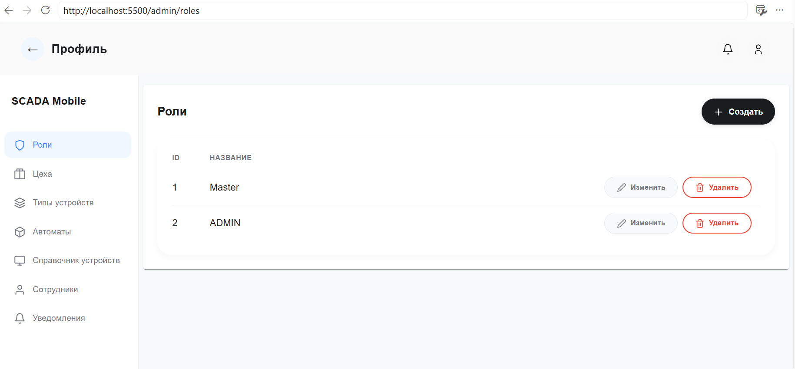  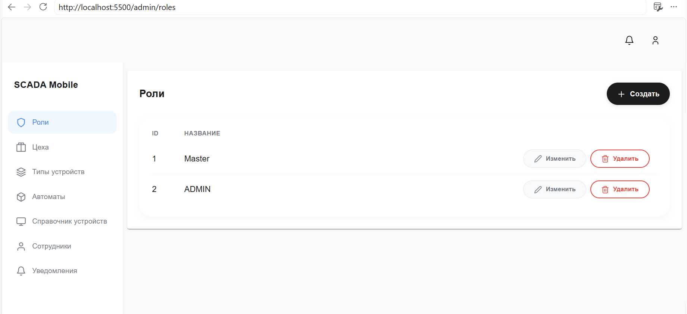 |  |  |  |
| 2 | Зашел на страницу админ-панели `http://localhost:5500/admin/` | В шапке надпись "Панель администратора" | Надпись "Профиль" | Минор | 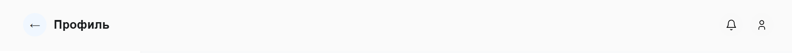 |  |  |  |
| 3 | Зашел на страницу `http://localhost:5500/admin/roles/1` | Кнопка "Сохранить" в режиме disabled до тех пор, пока не были применяны какие-либо изменения | Кнопка "Сохранить" доступна всегда | Минор | 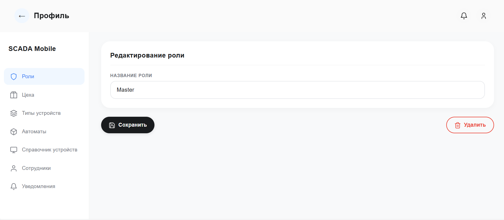 |  |  |  |
| 4 | Зашел на страницу `http://localhost:5500/admin/units` -> пролистнул вниз страницы таблицу -> перелистнул на следующую страницу -> сразу перелистнул назад на 1 страницу | Страница при переключении должна оставаться внизу всегда, пока пользователь не пролистнёт сам наверх | Страница резко перескочила на середину прокрутки | Минор | 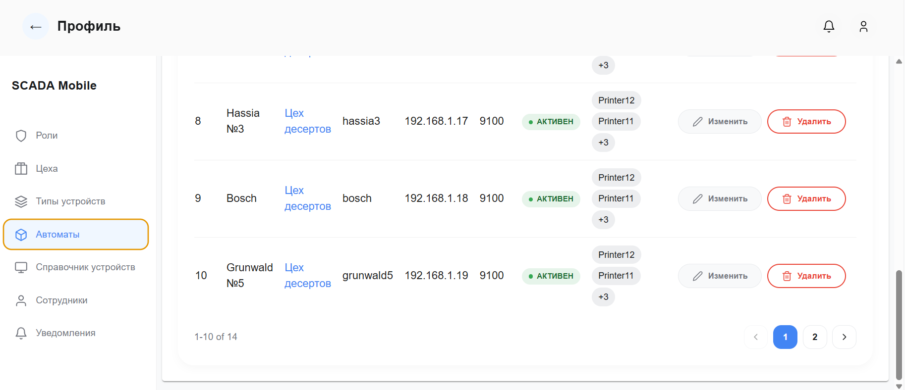  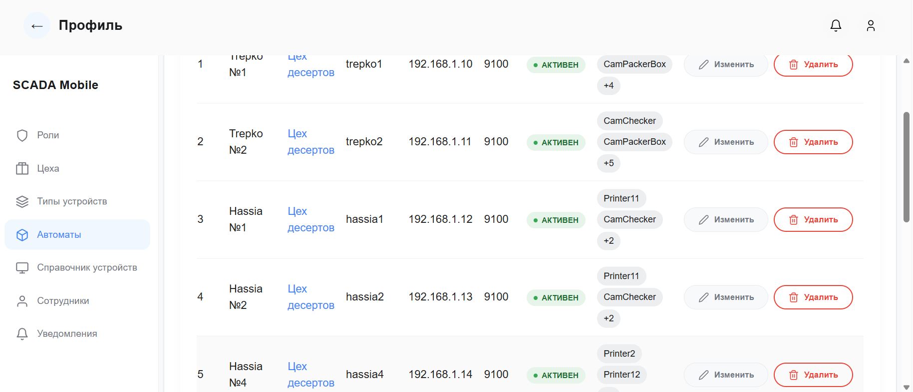 |  |  |  |
| 5 | Перешел на страницу `http://localhost:5500/admin/` | Кнопки "Изменить", "Обновить", "Все прочитаны", "Отмена" достаточно контрастны | Недостаточно контрастен текст, иконка в кнопке и обводка кнопки | Минор | 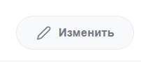  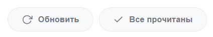 |  |  |  |
| 6 | Перешёл на `http://localhost:5500/admin/roles` -> нажал "Создать" -> ввел в поле -> нажал "Сохранить" | Появляется сообщение об успешном сохранении, страница перенаправляется назад на `http://localhost:5500/admin/roles` с `http://localhost:5500/admin/roles/create` | Страница не перенаправилась, остался на `http://localhost:5500/admin/roles/create` после сохранения | Крит | 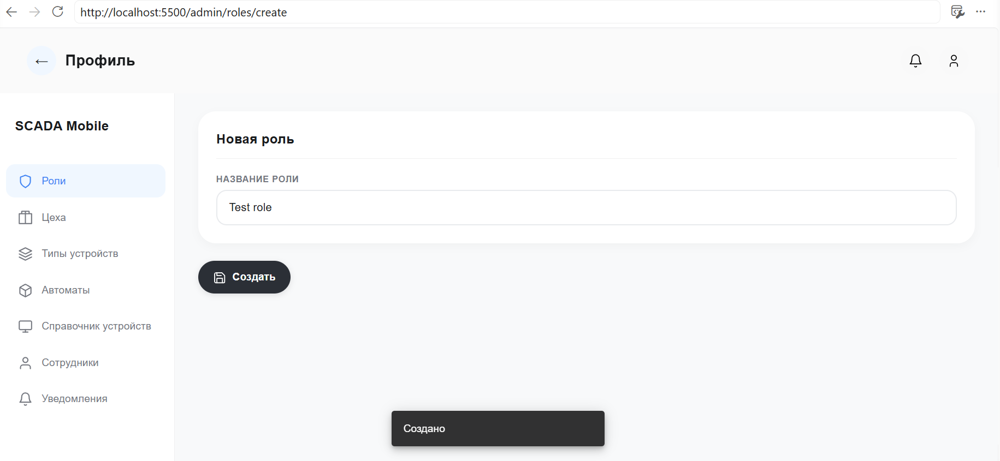 | Тоже самое при изменении уже существующей записи |  |  |
| 7 | Перешел на `http://localhost:5500/admin/roles` -> нажал "Удалить" у первой попавшейся записи в таблице | Появление overlay для подтверждения удаления | Открылась страница деталей записи, как будто я нажал на саму запись, а не на кнопку "Удалить" | Крит | 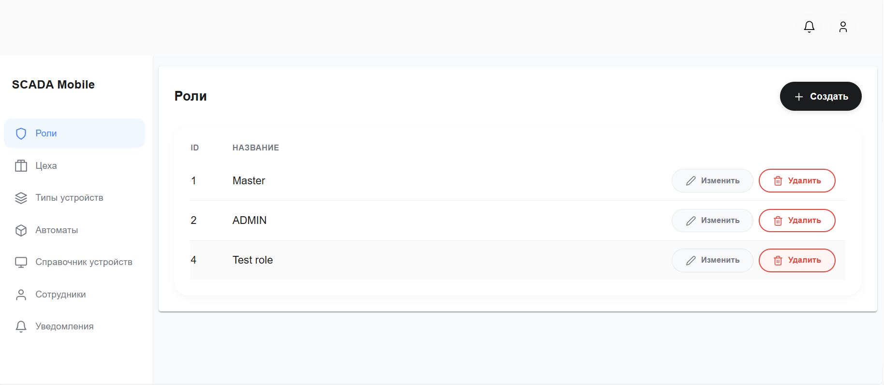  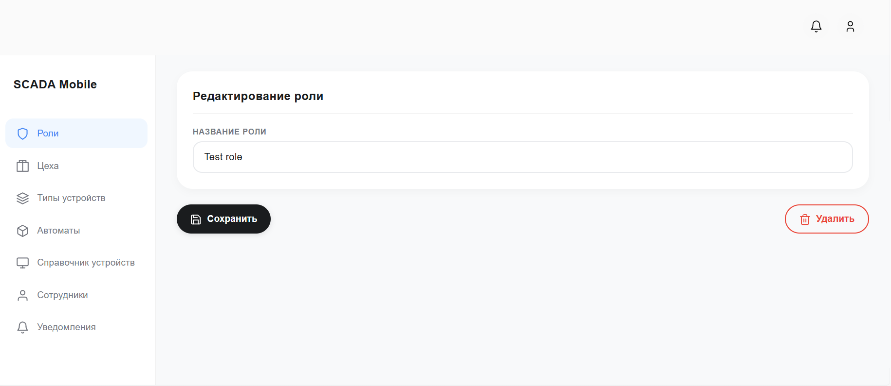 |  |  |  |
| 8 | Перешёл на `http://localhost:5500/admin/roles/4` -> нажал "Удалить" -> в окне подтверждения нажал "Удалить" | Перенаправление к списку ролей | После удаления остался на странице `http://localhost:5500/admin/roles/4` уже удаленной записи (сама логика удаления работает) | Крит | 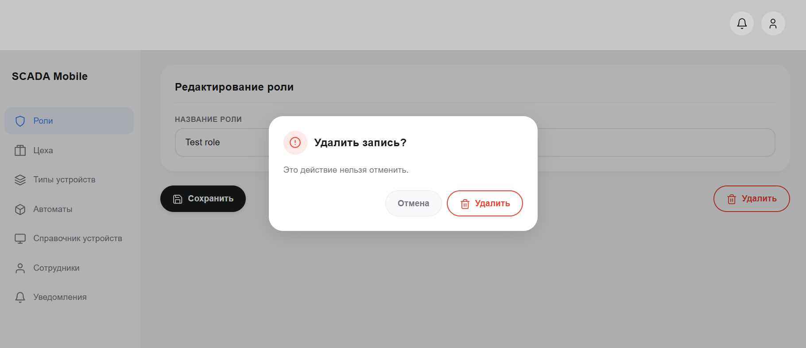  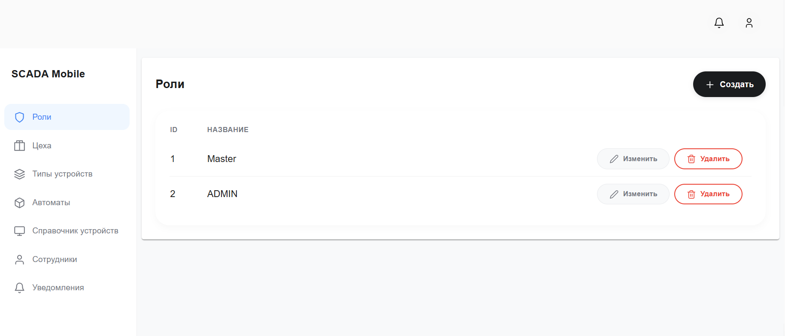 |  |  |  |
| 9 | Перешел на `http://localhost:5500/admin/roles` -> нажал "Изменить" -> внес изменения -> нажал "Сохранить" -> перешел на `http://localhost:5500/admin/roles` -> изменения есть -> перезагрузил страницу -> изменения слетели / переключился с `http://localhost:5500/admin/roles` на любую другую -> переключился обратно на `http://localhost:5500/admin/roles` -> изменения слетели | Изменения персистентны. После сохранения данные изменяются в первую очередь на сервере -> данные на фронт подгружаются из сервера | Обновленные данные не сохраняются в БД | Блокер | 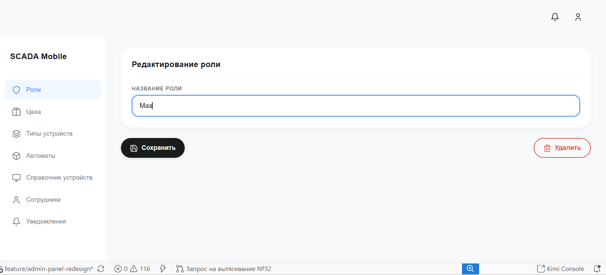  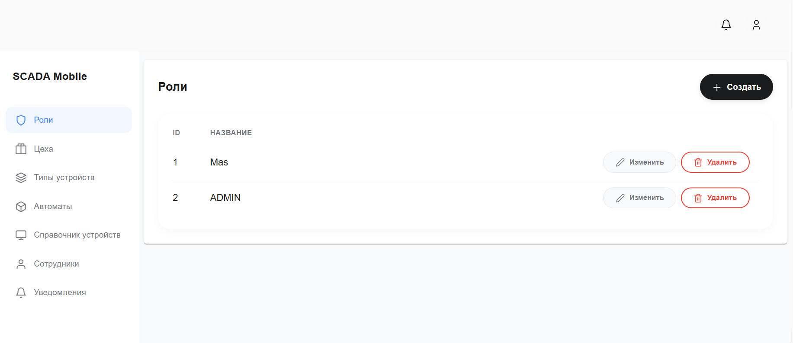  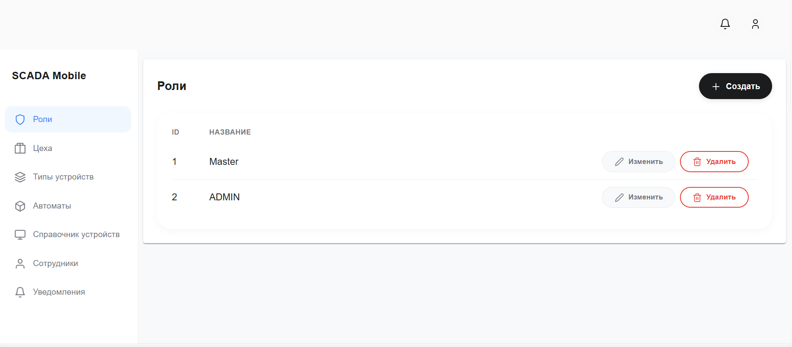 | Это происходит при попытке изменить абсолютно любые данные в абсолютно любой таблице |  |  |
| 10 | В левом боковом меню в пункте меню "Сотрудники" должна использоваться иконка та же самая, которая используется в шапке в кнопке перехода в профиль. Старую svg удали. | Иконка единообразна | | Минор | 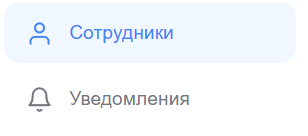  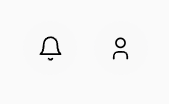 | |  |  |
| 11 | Косметическое улучшение: удали тени у элемента таблицы (на всех страницах), пусть станет более плоским именно эта часть | Таблица без теней | | Минор | 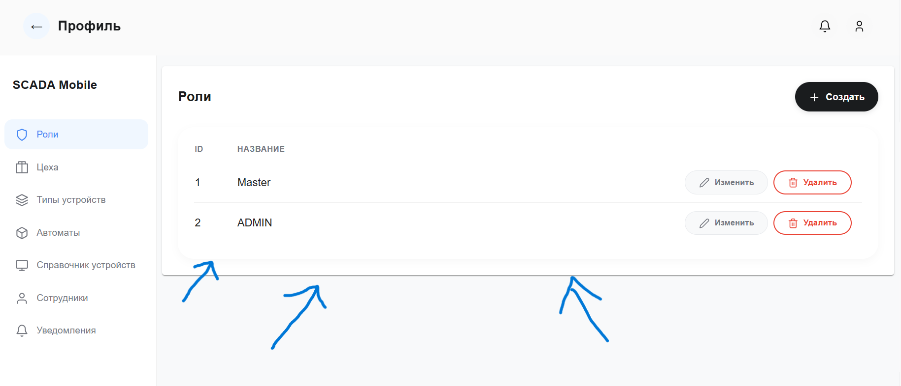  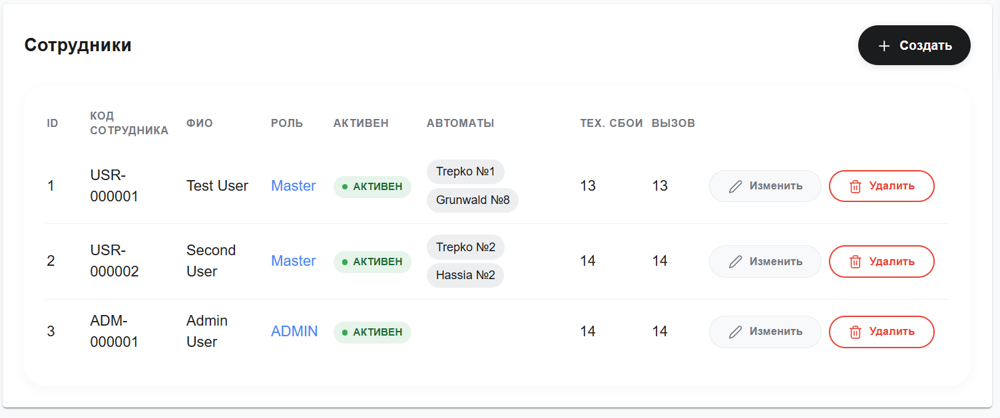 | |  |  |
| 12 | На вкладках "Автоматы" `http://localhost:5500/admin/units`, "Справочник устройств" `http://localhost:5500/admin/device-catalog` и "Сотрудники" `http://localhost:5500/admin/users` некоторый текст сделан как ссылка - имеет синий цвет, но таковым не является. Лучше пока просто перекрасить его в цвет остального текста в таблице, чтобы не путать пользователей | Текст не выглядит как ссылка | | Минор | 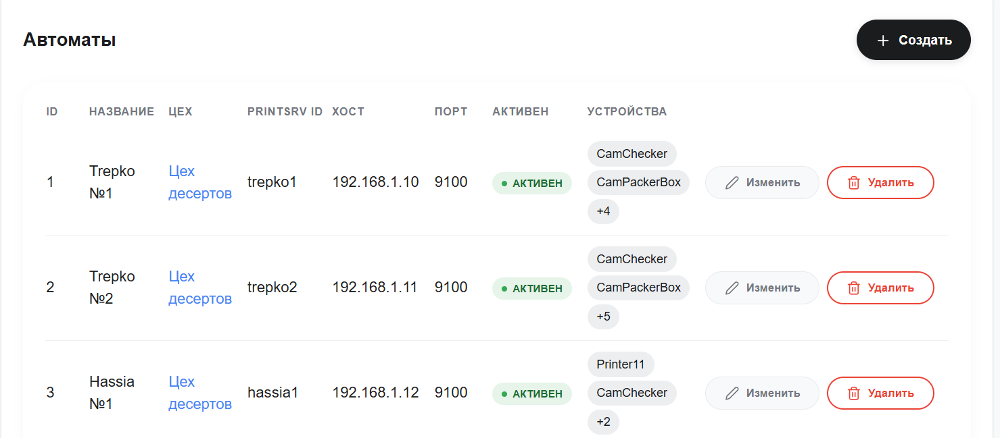  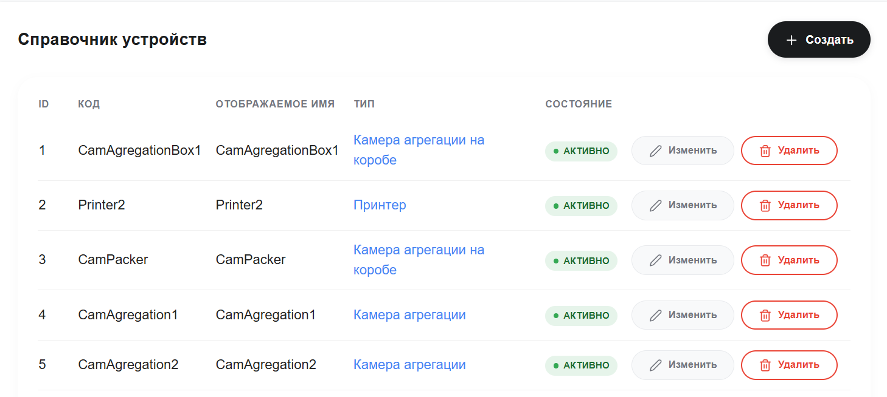  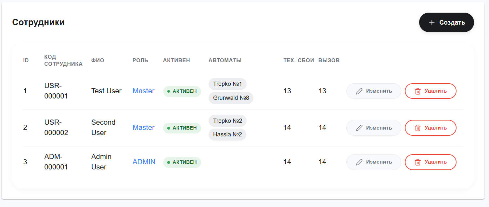 | |  |  |
| 13 | В любой из таблиц должно корректно отображаться отсутствие значения (тире) | Отсутствие значения отображается тире | | Минор | | |  |  |

### Приоритеты

- **Блокер** — не могу выполнить задачу
- **Крит** — выполняю, но с трудом / обходным путём
- **Минор** — косметика, опечатка, лишний пиксель

---
